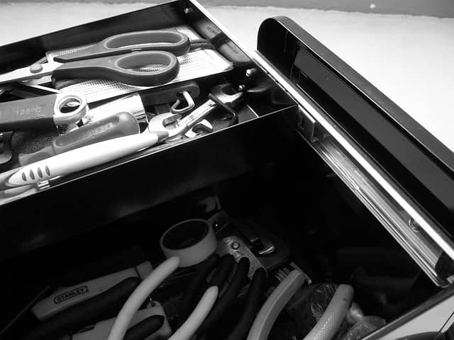

# Preamble

## How to read this book

You are not holding a book. You are holding a toolbox!

Event Storming addresses many challenges. Like a tool that you use for a specific task, each of the following toolsets targets a specific need or challenge.

Our initial goal with this book was to offer practical and applicable guidance while keeping the reading time under one hour… Let's face it: we failed! Reading this book from cover to cover takes about two and a half hours. Yet, unless you are an Event Storming nerd like us, you probably don't need to read the whole book! Pick your toolset and close the book in 60 minutes.

### Toolsets

* **For an introduction to Event Storming** (≈ 15 min), read:
  * [The essence of Event Storming](#essence-of-event-storming)
  * [Why would you want to run a Big Picture Event Storming?](#big-picture--why)
  * [Why would you do a Design Level Event Storming?](#design-level--why)
  * [3 questions to know if Event Storming the Flow can help you](#flow--3-questions)

* **For a comprehensive overview of what Event Storming is about** (≈ 55 min): Start with [The essence of Event Storming](#essence-of-event-storming) and then move to the part on [Big Picture Event Storming](#big-picture).

* **If you are interested in improving collaboration when doing architecture** (≈ 50 to 70 min):

  * Dive into [Big Picture Event Storming](#big-picture) to explore the problem space with a large audience (≈ 50 min)
  * You _can_ continue with [Design Level Event Storming](#design-level) to dive into the Domain Driven Design for a core functional area (≈ 20 min)

* **To optimize workflows** (≈ 35 min): begin with [Event Storming the Flow](#Event-Storming--Flow) and pay special attention to [Identify where to act to improve your workflow](#flow--levers).

* **For remote facilitation** (≈ 35 min): go directly to [Rethinking Event Storming in Remote](#remote-event-storming). In case you are completely new to Event Storming, we advise you to start with one of the above proposals first.

* Finally, if you want to learn **Event Storming in depth** (≈ 2 h 30), the book reads well from cover to cover. You'll be ready to run your first Event Storming workshop with confidence.

### Event Storming Tips

If you are already familiar with Event Storming, or if you have particular questions after reading the above, the [Tips section](#tips) is for you (≈ 10 min)! It contains:

- General Event Storming Tips
- An index of all the tips we shared in the book, in the form of an FAQ

## For an optimal epub reading experience

We took some time to style the book so we advise you to use an epub reader and settings that respect the original style as much as possible. Here is where we tested that it renders well:

- On iOS and macOS, the "Books" app works great, just select the original style
- On Windows, the "Freda" ebook reader has an option to use the "publisher's style"
- Overall, it renders better on a light background

That said, epub is meant to be customizable, so it's up to you!

## Acknowledgements

TODO

Murex
Shodo
Amy
Reviewers: Craig Morrison, Sebastien Garron, others
pixabay and wikimedia for images