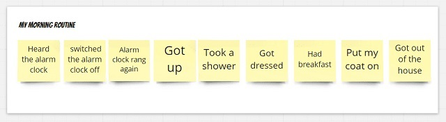
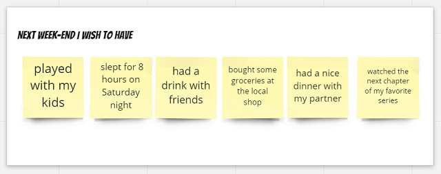
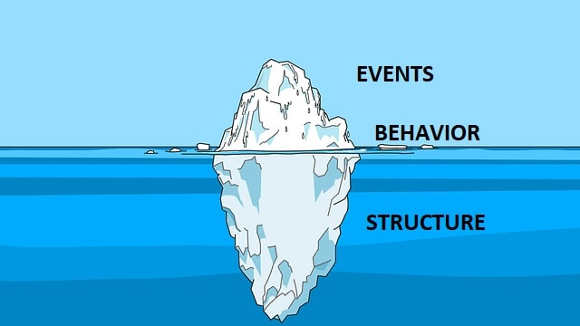

# The essence of Event storming

::: {.lead-statement data-latex=""}
ℹ️ **In this chapter:** _Identify events on stickies to make sure they happen as you wish. This is what event storming is about. This first chapter is an overview of the technique and its benefits._
:::

## Events are things that happen

Things happened for you this morning at the start of your day.

You probably heard the alarm clock, then switched it off. When it rang again, you got up, showered, got dressed, had breakfast, etc.

All these are _past events_.

Events will also happen _in the future_.

If you imagine the next weekend, for example, you may wish to have done the following stuff by Sunday:

- played with your kids,
- slept for 8 hours on Saturday night,
- had a drink with friends,
- bought some groceries at the local shop,
- had a nice dinner with your partner,
- watched the next chapter of your favorite series.

**Event storming is the act of displaying these _events_ on a wall.**

That's it! You've now understood what event storming is about!

Ok, ok... maybe you want to know a bit more, but, honestly, you already know all the basics!

 **Event storming is a technique to collectively visualize events and do something from there.**

## Why would you want to visualize events on a wall?

> Like the tip of an iceberg rising above the water, events are the most visible aspects of a larger complex - but not always the most important - _Donella H. Meadows in Thinking in Systems_

Guess what? Events do not happen by magic!

To use Donella Meadows's iceberg metaphor, once events are visible, you can look below the surface. And the system structure is what resides below the surface. **The _structure_ of a system is what causes its repetitive behavior, which in turn is observed through events.**

Here is an example from this morning:

- You switched off the alarm clock this morning (_event_).
- You do this 4 times every morning on average (repetitive _behavior_)
- And, guess what: every night, the concentration of caffeine in your blood is high (this concentration is one expression of the system _structure_)

## Summary: what is event storming about?

**To summarize, when you do event storming:**

- you start by visualizing the events, _the easily observable things_
- then you dig into _behavior_ and _system structures_

**Your goal can be**, at will:

- either to change an existing system for the better
- or to design a system that will allow the desired events to happen (and the undesired ones to not happen).

Hopefully, at this stage, you are starting to get a sense of what event storming is about.

In the next part, you will learn how to use Event Storming to [**draft a software design in details**](#big-picture).

Later in the book, you will discover that Event Storming can also be used to [**improve a workflow**](#Event-Storming--Flow)
