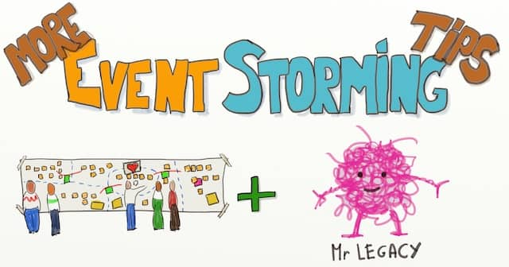

# Big picture Event Storming {#big-picture}

## Why would you want to run a big picture event storming? {#big-picture--why}

::: {.lead-statement data-latex=""}
ℹ️ **In this section:** _The traditional ways to define your architecture can result in slow delivery. Here are 3 simple checks to determine if Big Picture Event Storming is the good alternative approach._
:::

### Two architecture failure stories

::: {.sidenote data-latex=""}
📝 **What do we mean by Software Architecture?**
Software architecture refers to the fundamental structures of a software system and the discipline of creating such structures and systems. (<a href="https://en.wikipedia.org/wiki/Software_architecture">Wikipedia</a>)
This includes high-level requirements workshops, user exchange discussions, and domain knowledge sharing.
:::

#### How [big design up-front](https://en.wikipedia.org/wiki/Big_Design_Up_Front) and ivory tower architecture fail?

A few years ago, I (Philippe) worked for a bank as a contractor. I quickly noticed that everybody was talking about the PXT project. After a few more days, I understood that PXT was a massive project with an ambitious goal. The project aimed at re-designing fundamental banking abstractions through the whole information system.

Architects and business 'visionaries' had planned the project without involving 'mortal' developers. As the project moved on, this new model kept looking more unrealistic. Yet, the project lingered for a few years, involving hundreds of people. Ultimately, it was canceled, leaving wasted time and code bases in schizophrenic states.

This story could serve as a case study for ivory tower architecture. Indeed, as often with this kind of project, PXT was a failure:

*   The system did not evolve in the desired direction. It did not deliver its promises on performance, maintainability, evolvability, operations, support…
*   The project cost a lot more than the initial plan. The scope kept growing to accommodate for what was missing from the initial blueprint.
*   Business experts and architects had wasted _a lot_ of time trying to figure out all the details up front.
*   Team members did not feel engaged in the project. They had not been involved in any decision-making. Many of them saw themselves as mere executors.

#### How does emergent architecture fail?

If Big Up-Front Design does not work, could emergent architecture be a better strategy? In many ways, it is, but it also comes with its own issues.

Some time ago, I (Philippe) decided to learn the Ruby programming language, so I started attending Ruby meetups. Most [Ruby](https://www.ruby-lang.org/) developers work with Rails, a framework for building web applications. As I chatted with [Rails](https://rubyonrails.org/) programmers, I discovered that most were facing the same issue. As their code base grew, they all ended up crawling in a monolith of dependency.

Rails is a beautiful platform. In no time, you can set up a perfectly working website that looks great and that is thoroughly tested. Rails comes with design guidelines and an extensive test harness. Unfortunately, these are so handy that most developers overgrow their applications inside them. Nevertheless, it happens smoothly, slowly, and safely, delivering features along the way. Yet one day, they realize that new features have become incredibly slow to write!

Here is what we observed with this kind of 100%-emergent style of architecture:

*   Non-developers have no clue about what developers are doing. The code has become a big ball of dependencies. This makes it difficult to communicate any kind of status to people who don't code.
*   With enough tests and refactoring skills, developers can implement any feature. Yet, it always takes more time than expected! 'Refactoring' repeatedly comes up as the explanation for the extra time.

#### Both these approaches waste time and effort and result in slow delivery!

Both emergent and Big Up-Front Design architecture are failure strategies! Should we abandon all hope?

> Wouldn't it be great if we had a magic spell to avoid these pitfalls?

It turns out **there is a middle way, and it's called Big Picture Event Storming!**

### Common symptoms

Let's first understand the problem itself. Although these two stories sit at both ends of the spectrum, they have key elements in common!

#### No obvious solution

Let's reason by absurd and suppose there _was_ an evident architecture:

*   Architects would have found it upfront... And everything would have flowed nicely from there!
*   Or the developers doing emergent design would have quickly refactored their code towards this obvious solution... And everything would have flowed nicely from there!

Our two stories did not end that way, meaning there was no evident architecture!

#### Not a lack of skills

Nowhere in the story did we hear about people failing to do something. Improving any of the people's skills would not have changed the story. Suppose developers get better at refactoring, and architects better at designing. Developers would have spun the refactoring wheel a bit faster. Architects might have saved 1 day of architecture meetings. Yet, the projects would have remained stuck in their failure loop in both stories! 

#### The problem persists

In both stories, the teams were trapped in a repeating loop. Whatever efforts the people put into doing-it-better-this-time, the loop repeats itself:

*   Doing more design up front means more time spent on architecture and more delays. It's also betting on the future, which means even more delays when the real-future comes to life!
*   Doing more emergent design means deferring _all_ clean-up for the next feature. Think of it as leaving the kitchen in a mess after cooking. This slows the delivery of upcoming features and makes any architecture change daunting.

Whatever approach you chose, doing 'more' of it will not fix the challenge!

### Big Picture Event Storming is the middle way!

Big Picture Event Storming puts _everyone_ together to define a "Rough Up-Front Design" in 2 days.

*   **Big Picture Event Storming is not trying to do everything right the first time**. Instead, it acknowledges that **it's better to start with a rough design and improve from there**.
*   **Big Picture Event Storming is not discovering everything as we go**. Instead, it acknowledges that **a bit of up-front thinking might save us a lot of time down the road**.
*   **Big Picture Event Storming works best when followed with incremental and emergent design**:
  *   To continuously steer the codebase towards the agreed architecture vision
  *   While leaving options open.

We should also re-run the Big Picture Event Storming from time to time to update the vision.

Compared to traditional architecture, Big Picture Event Storming features unique benefits:

1.  **Everyone will feel engaged and responsible for the decisions made during the event.**
2.  Thanks to face-to-face communication, **the workshop grows common knowledge of the problem.**
3.  The workshop triggers open and honest communication between everyone involved. As a result, **everybody gets a clear status of where we all stand**.

Ultimately, Big Picture Event Storming impacts the users' lives sooner!

::: {.sidenote data-latex=""}
📝 **What about culture?**
One reviewer rightfully noted that these failure examples are not only about the tool but also about the design culture. Indeed, both examples highlight some extreme forms of architecture culture. Event Storming, as a middle-way practice, will work better in a collaborative and adaptive culture. Yet, before we knew about Event Storming, we were at a loss about how to apply such culture in practice! For us, Event Storming was the key to unlock this culture. Even more, Event Storming showcases a different way to people, and nudges the culture at the same time!
:::

### How do you know if Big Picture Event Storming could help you?

When you face an architecture challenge, check whether the following statements are true:

1.  **Does there seem to be no evident architecture?**
2.  **Do the people have the skills to tackle the challenge?**
3.  **Does is look like your progress has stalled despite all your efforts?**

If all these are true, try Big Picture Event Storming! This book is your guide.

## How to prepare a Big Picture Event Storming workshop {#big-picture--prepare}

::: {.lead-statement data-latex=""}
ℹ️ **In this section:** _[Event Storming](https://www.eventstorming.com/) is an excellent way to draft a shared architecture from a functional point of view. Here are 5 essential preparation tips to turn your first workshop into a success!_
:::

### Homework first!

You've decided that Big Picture Event Storming is the way to go, and you're eager to start one. Not so quick, though! As with many things, lack of preparation can turn your promising workshop into a total failure.

> Before anything, preparation is the key to success. ([_Wikiquotes_](https://en.wikiquote.org/wiki/Alexander_Graham_Bell)) [Alexander Graham Bell](https://en.wikipedia.org/wiki/Alexander_Graham_Bell)

**There are five key elements to prepare an Event Storming:**

- [Active Sponsorship](#big-picture--prepare--sponsorship)
- [A Clear Scope](#big-picture--prepare--scope)
- [The Right Audience](#big-picture--prepare--audience)
- [An Enticing Invitation](#big-picture--prepare--invitation)
- [An Effective Briefing](#big-picture--prepare--briefing)

Let's go through each of these in detail.

### Active Sponsorship {#big-picture--prepare--sponsorship}

At this point, the most important thing to do is to find good sponsorship. By "good sponsorship", we mean having support from influential people. What **you want is your workshop to stop being your initiative and to become the group's initiative**. **Getting backup from the influencers will dramatically increase your chances of success.**

Usually, **private chats with these people are the best way to win them over**. In the end, you want them to share and support a common goal for the Event Storming session. One of the first sessions we ran didn't go very well because we had omitted this step. Some people wanted to draft a target architecture to know how to refactor in the long term. Others wanted to understand the main blocking points and identify the first wins. As a consequence, the session was disappointing. ☹

### A clear Scope {#big-picture--prepare--scope}

With a clear goal in mind, you should have a rough idea of the scope of the session. Event Storming is an exploratory activity. People who are not used to it will feel a bit lost at first. We found that **it's better to boot the workshop around 1 or 2 uses cases makes people more comfortable.** So, chat with your sponsors or other domain experts to agree about these use cases before the session.

As we said, Event Storming is exploratory by nature. Discussions about these use cases will bring in other concerns during the session. It will be up to the group to decide whether to add them to the scope or not. It's ok to start with clear and specific use cases; there's no need to be afraid to miss things out.

It's also a good idea to **identify a first [domain event](https://martinfowler.com/eaaDev/DomainEvent.html)**. It will both serve as an example and a way to trigger the Event Storming. From experience, this event should be somewhere in the middle of the story. It should also be clear enough for everybody to understand. Examples:

* "A trade was booked"
* "An order was paid"
* "Checked out from room"

Don't worry if you wonder what a domain event is; we'll get into the details later.

### The Right Audience {#big-picture--prepare--audience}

It's time to list the ideal audience. As a rule of thumb, we found that **sessions work better with a mix of 50% of domain experts and 50% of technical people**.

With too few domain experts in the room, the workshop becomes a one-way teaching lesson. Ideally, you'd have experts for all the functional aspects you foresee in the scope of the workshop.

We also need to **have a fair share of technical people in the workshop. In the end, it's their domain knowledge we want to grow**. Don't forget that, as [Alberto Brandolini](https://twitter.com/ziobrando) says:

> It’s developers (mis)understanding, not expert knowledge that gets released in production

Original Tweet from [Mariusz Gil](https://twitter.com/mariuszgil/status/857924761497866242)

Try to maximize the diversity of technical roles to create buy-in. One of the critical advantages of Event Storming is that it scales to a large audience. If possible, **send a call for volunteers among teams to make sure everyone feels welcome**. This will increase buy-in even further.

::: {.sidenote data-latex=""}
📝 **Assign roles to domain experts**

Running an Event Storming workshop is more challenging for business-to-business “off-the-shelf” vendors. Getting actual end-users or client domain experts to attend is almost impossible.

**The trick is role-playing by assigning business roles to in-house domain experts**. Don’t hesitate to have various roles for the different end-users. This way, all aspects of the business will be focused on. For example, if you were designing Airbnb, you could assign a 'renter' role to a domain expert who understands these users’ needs.

>💡 If you cannot have real users in the Room, assign business roles to your domain experts.

Get help from your stakeholders; preparing the roles beforehand should be very easy.
:::

### An Enticing Invitation {#big-picture--prepare--invitation}

By now, you should have sponsors, a clear goal, a few starting use cases, and the ideal audience. The next thing to do is to send enticing invitations. Your organization's culture will define the level of effort needed to get people to attend. Maybe a simple email will be enough, or perhaps you'll need to meet everyone in person to have them present.

**Make sure that the sponsorship is visible in the invitation to maximize buy-in.** For example, ask an influential sponsor to send the invite for you.

**If you can, sketch a visual invitation. This will set the tone for a different kind of architecture meeting.**

::: {.sidenote data-latex=""}
📝 **Twice 2 hours per day is sustainable**

Getting people to dedicate one or two full days to a workshop can be tricky. After four hours of Event Storming, people also get too tired to be effective.

The best schedule we found around these problems is to do two times, 2 hours per day.

- 2 hours in the morning
- lunch
- 2 hours in the afternoon
- repeat for as many days as needed

People will have time to rest. The breaks will also trigger their [System 2 brains](https://en.wikipedia.org/wiki/Thinking,_Fast_and_Slow) (background processing), and they might come back with new intelligent ideas!
:::

### An Effective Briefing {#big-picture--prepare--briefing}

When you have your final list of attendees, **brief them about the goal of the workshop**. This helps people in many aspects:

* To understand that the goal is worth their time
* To be ready for the initial disorientation
* To get an idea of how the session will go
* To get answers to quick questions

We found that **a quick 15 to 30 minutes gathering works well**, but again, you might need to adapt to your organization. For example, groups that are used to written communication might prefer email, chat, or wiki. What is important is that people can ask questions and get answers.

::: {.sidenote data-latex=""}
📝 **Distribute domain-specific learning material**

If you work in a complex domain, there will a lot to learn for developers. Think of newcomers, for example. They will have a hard time understanding all the discussions during the workshop. Fortunately, **most of these complex domains have ready-made reference learning material**.

For example, derivative financial software has [“The Hull.”](https://www.goodreads.com/book/show/100827.Options_Futures_and_Other_Derivatives) It’s like the Bible of finance. **Sharing snippets before the workshop will help people to hit the ground running**.

Domain experts can play a crucial role here. Asking them to compile specific material to share before the upcoming workshop will be helpful for everyone. And as a bonus, you will get them more involved and engaged!
:::

### On good tracks!

If you follow these steps, your Event Storming session is already on good tracks! Let's now see how to prepare the room for a successful session.

## How to prepare the room for a Big Picture Event Storming {#big-picture--room}

::: {.lead-statement data-latex=""}
ℹ️ **In this section:** _Running a Big Picture [Event Storming](https://www.eventstorming.com/) workshop only requires standard supplies. Here is a detailed checklist._
:::

Before we jump into the actual animation, here is the material you&#39;ll need:

- [A Visual Agenda](#big-picture--room--visual-agenda)
- [A long wall](#big-picture--room--design-space)
- [A long strip of paper](#big-picture--room--design-space)
- [Stickies](#big-picture--room--stickies)
- [Sharpies](#big-picture--room--sharpies)
- [A Small Table](#big-picture--room--table)
- [Food](#big-picture--room--food)

::: {.sidenote data-latex=""}
📝 **What if we are remote?**
Obviously, this only applies to physical Event Storming workshops. The supply list will be very different for a remote Event Storming. You'll find more details in the [Remote Event Storming chapter](#remote-event-storming).
:::

### A Visual Agenda {#big-picture--room--visual-agenda}

One critical thing to prepare before the session is a [Visual Agenda](https://gamestorming.com/visual-agenda/). As we explained, participants may feel destabilized by the mass of information and ideas that emerge during an Event Storming. To help them through, **before the session begins, stick the Visual Agenda on the room&#39;s walls. Participants will know when they enter that they are here for a different workshop**. Also, walking them through the various steps of the Visual Agenda before they start will reassure them. It&#39;s also **an excellent way to highlight the few rules of Event Storming**.

You can find explanations about how to prepare a Visual Agenda in the GameStorming [book](https://www.amazon.com/Gamestorming-Playbook-Innovators-Rulebreakers-Changemakers/dp/0596804172/ref=sr_1_1?ie=UTF8&amp;qid=1544163919&amp;sr=8-1&amp;keywords=gamestorming) or [website](https://gamestorming.com/visual-agenda/).

You must be wondering what the steps actually are. Don&#39;t worry; we&#39;ll cover this just after. For now, here is a list of other supplies you&#39;ll need to run an Event Storming workshop.

::: {.sidenote data-latex=""}
📝 Event Storming can be a somewhat destabilizing workshop. A Visual Agenda will reassure first-time attendees.
:::

### Infinite Design Space {#big-picture--room--design-space}

By far, **the most challenging thing to find is a big enough wall to do the workshop!** [Alberto Brandolini](https://twitter.com/ziobrando?lang=en), the inventor of Event Storming, recommends an 8 meters long wall. **Having an &#39;infinite&#39; design space has two benefits:**

- **Participants won&#39;t constraint their ideas**, creativity, and visualization to the available space
- **Participants will have enough place walk around and collaborate** at will

If you have a large enough room, this should be your first choice. Alberto says that corridors can be good candidates too. My own experience with this was disappointing, though. Participants complained about other people coming and going all the time.

Once you&#39;ve found a room, you&#39;ll need a large paper roll to place your stickies on. **Using paper instead of the wall makes the workshop &#39;movable.&#39;** This way, you will be able to add more design space if you need it. You&#39;ll also be able to stick it in your workplace for a few days after the workshop if you want.

### Stickies {#big-picture--room--stickies}

**Event Storming consumes a tremendous amount of sticky notes, especially orange ones, for domain events!** To summarize, you&#39;ll need:

- Many orange stickies, around one stack per person
- pink stickies
- large yellow stickies
- small yellow stickies
- blue stickies

Each color has a specific meaning in the Event Storming legend. We&#39;ll see how these are used later.

### Sharpies {#big-picture--room--sharpies}

Obviously, **people will need something to write on the stickies. Sharpies or small markers are the best**. They are readable from a few meters but still let you write enough words on a single sticky.

### No Chairs

Typical meetings are boring and get people sleepy. In comparison, a successful Event Storming workshop keeps people energized and productive. **Removing chairs and meeting tables in the area helps people to stay energized**. However, we don&#39;t want Event Storming to become a slow torture session either! This means **you&#39;ll need to schedule enough breaks**.

### A Small Table {#big-picture--room--table}

We&#39;ll need somewhere to place our supply of stickies and sharpies. A small table will be the final addition to our setup.

### One last thing… food! {#big-picture--room--food}

If you can, bring some [food and drinks](https://philippe.bourgau.net/how-we-increased-productivity-by-25-with-a-fruit-basket-at-work/). **The workshop can be tiring; having food around sustains participants&#39; energy longer**.

::: {.sidenote data-latex=""}
📝 We beg you to bring food to avoid #DeathByEventStorming
:::

### Everything is ready!

By now, you should have everything ready to run your first Event Storming! Let's walk through a typical workshop.

## Step by Step Guide to run your Big Picture Event Storming {#big-picture--guide}

::: {.lead-statement data-latex=""}
ℹ️ **In this section:** _From energizing the audience to reading the story of your domain, here are all the steps that you will go through during a Big Picture Event Storming._
:::

Finally, we are getting to the real thing!

Here are the 9 steps of an Event Storming

1. [Preparing the Room](#big-picture--guide--room)
2. [Energizing the audience](#big-picture--guide--energizing-the-audience)
3. [Briefing and Presenting the Agenda](#big-picture--guide--briefing)
4. [Generating Domain Events](#big-picture--guide--domain-events)
5. [Sorting Domain Events](#big-picture--guide--sorting)
6. [Adding Actors and External Systems](#big-picture--guide--actors-and-externals)
7. [Storytelling](#big-picture--guide--storytelling)
8. [Reverse Storytelling](#big-picture--guide--reverse-storytelling)
9. [Closing](#big-picture--guide--closing)

### Preparing the room {#big-picture--guide--room}

You want to have the room ready when participants arrive. **Come to the room 30 minutes early to prepare it for the workshop**. [How to prepare the room for a Big Picture Event Storming](#big-picture--room) has all the room preparation details. Roughly, this includes:

- Removing tables and chairs
- Sticking the design paper to the wall
- Sticking the Visual Agenda to the wall
- Laying down the rest of the material somewhere

### Energizing the audience {#big-picture--guide--energizing-the-audience}

Picture from [funretrospectives.com](http://www.funretrospectives.com/)

As we&#39;ve already said, Event Storming is a different kind of architecture meeting. Our advise is to **run a collective physical energizer to get people out of their habits and raise engagement**. You can find many great physical energizers at [funretrospectives.com](http://www.funretrospectives.com/category/energizer/). We&#39;ve had success with many of them.

::: {#big-picture--guide--energizing-the-audience--double-pomodoro .sidenote data-latex=""}
📝 **Manage your breaks with the Pomodoro**

**A double Pomodoro is the most productive and sustainable schedule for Event Storming.** If you are unfamiliar with the Pomodoro technique, the Wikipedia page is a [short crash course](https://en.wikipedia.org/wiki/Pomodoro_Technique). Here is a summary of the double Pomodoro:

- **Workshop for 50 minutes**
- **Break for 5 minutes**
- **Repeat twice and take an extended 15-minute break**

| **Characteristic** | **Classic Pomodoro** | **Double Pomodoro** |
| --- | --- | --- |
| Length | 25 minutes | 50 minutes |
| Short break | 5 minutes | 5 minutes |
| Long break every | 4 pomodoros | 2 pomodoros |
| Long break | 15 minutes | 15 minutes |

When we first tried the classic Pomodoro, we were cutting off interesting discussions all the time. In practice, 50 minutes seems to work better.

People usually overflow the break, so most Pomodoros take a full hour instead of 55 minutes. Without enough breaks, people will get tired, and the workshop will not be as productive.
:::

### Briefing and presenting the plan {#big-picture--guide--briefing}

**Now is the time to present the workshop to the participants. Start with the goal, scope, and use cases**. It&#39;s the right moment to explain the step participants will go through and how each step will help them to reach their end goal. Adding a visual agenda helps a lot here. It&#39;s also an excellent time to introduce some general conventions.

Your Big Picture Event Storming briefing should introduce:

1. [The general goal](#big-picture--guide--briefing--why)
2. [The scope and use cases](#big-picture--guide--briefing--scope)
3. [What a domain event is](#big-picture--guide--briefing--domain-events)
4. [What a domain definition is](#big-picture--guide--briefing--ubiquitous-language)
5. [How to record questions and problems](#big-picture--guide--briefing--problems)
6. [And a few simple rules to ensure the success of the workshop](#big-picture--guide--briefing--last-things)

Here is how we usually start our Big Picture Event Storming workshops

> #### Introduction: why and who {#big-picture--guide--briefing--why}
>
> Thank you for being here. I&#39;m \<_your name_\>, and I will be your facilitator during this Event-Storming workshop. Before you start, let me share a few guidelines.
>
> **The primary outcome of this Event-Storming workshop is the shared knowledge between domain experts and developers**. That is why [Name], [Name] and [Name] are here, as domain experts and [Name], [Name] and [Name], as developers.
> 
> You&#39;ll build on this shared knowledge to draft a target architecture, but it can also help you make many other complex decisions.
> 
> Now that you know who is here and what this workshop’s goal is, let’s see how it will go.

::: {.sidenote data-latex=""}
📝 **State the goal of ‘sharing over learning.**

Typical feedback from domain experts is: “I did not learn that much.” I now systematically **repeat the primary goal of Event Storming at the beginning of a workshop: “The goal is 1st knowledge sharing, 2nd learning”**. You can even cite or display [Alberto Brandolini's tweet](https://x.com/ziobrando/status/634668319006683136?ref_src=twsrc%5Etfw%7Ctwcamp%5Etweetembed%7Ctwterm%5E634668319006683136%7Ctwgr%5Eaadead1cd32c9a2a47c37b2dafd144df2667f5bb%7Ctwcon%5Es1_c10&ref_url=https%3A%2F%2Fwww.eventstormingjournal.com%2Ffoundations%2F5-reliable-tricks-to-maximize-shared-knowledge-in-event-storming%2F):
:::

> #### Scope and use cases {#big-picture--guide--briefing--scope}
>
> Today, you&#39;ll cover <[_your scope_](#big-picture--prepare)>. To make things more concrete, you&#39;ll explore the following use-cases <[_list your use cases_](#big-picture--prepare)>.
>
> #### Domain Events {#big-picture--guide--briefing--domain-events}
>
> You will start by identifying domain events that happen during these use-cases, such as <[_your 1st event_](#big-picture--prepare)>. A Domain Event is simply something that happens in your system.
> 
> 
> 
> As you can see in this example, **you will use orange stickies to write events using past tense. This is a grammatical trick to create meaningful events**. Events are not actions of someone (not &quot;The trader books the deal&quot;). Even though some events will result from actions, we are not interested in actions yet.
> 
> **Here are a few more points to help you understand what domain events are**:
> 
> * They are not technical and should not be specific to your system&#39;s implementation
> * You could read about them in domain books
> * Domain experts understand them
> 
> When we use the word domain, it means the specific topic for which the system is developed. In your case, the domain is \<_your domain_\> (ex: trading book)
>
> **When identifying the events, you will be able to organize them in chronological order on this enormous piece of paper that you see on the wall**.

::: {.sidenote data-latex=""}
📝 **Do not talk about Domain Driven Design!**

Event Storming and Event-Driven Architecture came out of the Domain Driven Design communities. DDD is one of the most powerful tools to build solid software systems. Yet… It's also **full of obscure concepts and alien jargon!**

This is especially problematic when doing a Design-Level Event Storming, which goes deep into the DDD concepts. Starting with this flavor of Event Storming might be too big a step for people who don't know DDD.

Here is what you should do instead:

1. If you can, **replace DDD keywords with synonyms that the participants will be more familiar with**. For example, Functional area instead of Bounded Context. You can quickly mention the DDD name to DDD-savvy participants.
2. If you cannot find a satisfactory synonym, slowly introduce the DDD keywords and concepts, one by one, only as needed during the workshop.
3. Start with Big Picture Event Storming. It lets people get used to some DDD concepts.
4. Only later dive deeper with Design-Level Event Storming

People may love it so much that [you might start to do Domain Driven Design more explicitly](https://philippe.bourgau.net/how-to-use-event-storming-to-introduce-domain-driven-design/)!
:::

> #### Domain Definitions (aka [Ubiquitous Language](https://martinfowler.com/bliki/UbiquitousLanguage.html)) {#big-picture--guide--briefing--ubiquitous-language}
> 
> 
> 
> **Whenever you come across or agree on a domain word that may be confusing, feel free to define it on a large yellow sticky**
> 
> **Writing down the domain definitions is like building your own dictionary of what the words mean in your context. It is also called the domain's ubiquitous language**. This is very useful to prevent misunderstandings between all of you by making things as explicit as possible. This, in turn, improves how you work in many different aspects (ex: when choosing what to build or even refactor). Remember: the primary outcome of this Event-Storming workshop is shared knowledge.

::: {.sidenote data-latex=""}
📝 **Ask new joiners to collect definitions**

Newcomers are perfect for playing this candid role! **If a newcomer is in the workshop, leverage the opportunity to ask them to write down definitions**.

Newcomers don’t know much about the domain or the company. They are jargon detectors! Whenever they spot a word they don’t understand, their mission is to ask knowledgeable people to help them write a definition on a sticky note. By being active, they should also learn better!
:::

> #### Problems {#big-picture--guide--briefing--problems}
> 
> 
> 
> Likewise, **you will use purple stickies to park &quot;problems.&quot; Whenever you encounter**:
>
> * a question you cannot answer
> * something that does not seem right
> * or any problem you should look into
>
> Record it on a purple sticky.
> 
> #### Last things to know before starting {#big-picture--guide--briefing--last-things}
> 
>  Before we look at the detailed agenda, here are **5 crucial things that you should know**:
>
> 1. You must stick to domain language to keep this collaboration alive. **We&#39;ve seen Event Storming sessions drifting into technical discussions; this leads nowhere.**
> 
> 2. Event Storming is a visualization technique. Make sure you capture the topic that you are discussing on a sticky. **Remember that you should never be talking about something not yet displayed on the wall.**
> 
> 3. Remember that **Event Storming is a way to shrink months of [Big Design Up Front](https://en.wikipedia.org/wiki/Big_Design_Up_Front) into a few days!** It&#39;s going to be intense, but you&#39;ll accomplish a lot in a short time.
> 
> 4. Event Storming might feel chaotic. It might be rocky and go in unexpected ways at times, but we will adjust. **At the end of the day, though, the success mainly depends on how much you all want it!**
> 
> 5. Finally, to **keep the workshop pace sustainable**, we&#39;ll take a 5-minutes break every 50 minutes.

    

By [Philippe Bourgau](https://philippe.bourgau.net), under [CC BY-SA 4.0](http://creativecommons.org/licenses/by-sa/4.0/), [high resolution image](https://philippe.bourgau.net/first-rule-of-ddd-is-lets-not-talk-about-ddd/)

::: {.sidenote data-latex=""}
📝 **Re-narrate to help new joiners (and others) catch up**

It’s a fact: some people will miss parts of the workshop. Many of us suffer from overbooked agendas. Finding 8 hours where everyone is available is not easy. Some people will miss the beginning, the end, or a part in the middle.

New joiners will have difficulty catching up when collective intelligence is already growing. A good workaround is to re-narrate whenever someone joins.

The 2 hours chunks schedule also makes this easy. Plan 10 minutes at the beginning of every chunk for this storytelling.
:::

### Generating Domain Events {#big-picture--guide--domain-events}

This is when the workshop actually begins. **Ask attendees to stick as many [Domain Event](https://martinfowler.com/eaaDev/DomainEvent.html)s related to the use cases as they can think of**. To help them get started, be the first to place [the Domain Event you prepared](#big-picture--prepare) in the middle of the design space.

::: {.sidenote data-latex=""}
📝 [Alberto Brandolini](https://twitter.com/ziobrando)'s trick: ignite the Event Storming by sticking a prepared domain event on the design board.
:::

At some point, you&#39;ll see that the rate of Domain Event generation will dwindle down. That&#39;s the sign that it&#39;s time to move on to the next phase. 25 minutes or so are usually enough for this first phase.

::: {.sidenote data-latex=""}
📝 **What do you do if things are slow to start?**

The workshop can be slow to start. Participants can get lost in the chaotic nature of Event Storming.

A typical symptom is when people discuss in small groups and don’t stick domain-events.

In this case, go to the groups to trigger action. Make sure they understand the instructions. Kindly ask them to stick events as soon as possible. You might even add a bit of pressure by explaining that we’ll be doing a first event review in 10 minutes.
:::

::: {.sidenote data-latex=""}
📝 **How can you avoid being just-a-painful-facilitator when stickies are poorly written?**

Here’s a tip from [Alberto Brandolini](https://twitter.com/ziobrando). Stickies, in particular domain events, are often of poor quality initially. People need a bit of time to distinguish an event from a command.

Harassing them to rewrite their stickies won’t work!

Here is the trick: whenever you notice a low-quality sticky, flip it 45°. When people ask why it is flipped, repeat event-writing best practices and ask someone to rewrite the faulty domain-event sticky. With time, people will learn how to write good domain events, and the quality of what’s on the board will improve.
:::

### Sorting Domain Events {#big-picture--guide--sorting}

This is when Event Storming really starts. Simply **ask participants to sort the events chronologically**.

The goal is to represent the workflow on the design board. During the previous generation phase, people worked alone to write any event they could think of. This is going to change! They&#39;ll now need to speak to each other to sort the events.

This is where Event Storming does its magic. Likely, attendees have different points of view about the system. They materialized these with event stickies on the design board. Next, they will need to sort out their various points of view to order the events.

::: {.sidenote data-latex=""}
📝 Event Storming does its magic when people try to sort all the events.
:::

This phase should trigger intense discussions. Take the opportunity to nudge participants into capturing [domain definitions](#big-picture--guide--briefing--ubiquitous-language) and [problems](#big-picture--guide--briefing--problems) to look into. For example:

- If someone wrote an event &quot;Artifact created&quot; ask what an artifact is. Either they&#39;ll find a better word, or they&#39;ll write a definition for what an artifact is
- **As a facilitator, don&#39;t hesitate to ask the dumb question no one dares to**. If an event is written &quot;Calculation result sent&quot; ask &quot;What calculation? And what result?&quot;

The idea is to make everything that is implicit explit!

As they&#39;ll arrange the stickies in chronological, participants will identify alternate flows, or things that can happen concurrently. Invite them to **use swimlanes or vertical alignment** to represent these situations.

::: {.sidenote data-latex=""}
📝  **How do you represent Event Loops in the design?**

Any real-life domain contains some feedback loops. Drawing arrows on the design board won’t work as it prevents us from moving the stickies around later. Instead, you can model loops with duplicate stickies:

- A classic event sticky to where the event happens (usually to the right)
- A duplicate sticky with an arrow where the event feeds back into the system (usually to the left)
:::

### Adding Actors and External Systems {#big-picture--guide--actors-and-externals}

You should start to see the story of your system emerge. All good stories have heroes, though! This time, **ask attendees to identify actors (people with a role) and external systems (ex: an online API) that trigger or respond to events**.

Nothing would happen if no human interacted with the system. The convention is to use small yellow stickies for actors. There is no need to add an actor to every event; sticking one at the beginning of a chain of events is enough.

Similarly, your system also interacts with external systems. The convention is to use blue stickies for external systems. Just stick them where the events interact with the external systems.

You&#39;re getting close to the end! All the attendees should now have a good grasp of the big picture of the domain. So let&#39;s test this understanding a bit.

::: {#big-picture--guide--actors-and-externals--discussion-bottleneck .sidenote data-latex=""}
📝 **What to do if there is a single discussion bottleneck?**

Sometimes, all participants become the audience to a central dialog.

It’s often because a unique person knows some crucial information. In this case, you have no choice but to wait.

Sometimes, though, it happens for no reason. Intervene and split the group into two groups to work on two halves of the board. This implies merging and synchronizing at the end, but it’s a small price to pay to keep everyone engaged.
:::

### Storytelling {#big-picture--guide--storytelling}

It&#39;s time to check that the whole picture makes sense. Since the beginning of humanity, stories have been the vehicle of knowledge. Knowledge used to go from generation to generation through campfire stories. As a result, [our brains are hard-wired to listen, remember and make sense of stories](https://blogs.scientificamerican.com/guest-blog/it-is-in-our-nature-to-need-stories/).

Ask for volunteers from the audience. The first **volunteer is to narrate the story of the system by going through the events chronologically, explaining what is happening**.

As the narrator speaks, the audience will raise questions and notice incoherencies. This is yet another opportunity to add, remove or replace events to improve the story. More definitions might emerge too. If a problem seems too big to fix during the session, park it with a pink &quot;problem&quot; sticky.

Narrating the story can be tiring, so ask a new narrator to take over at some point.

::: {.sidenote data-latex=""}
📝 **Playing the silliest person in the room**

One of Alberto’s tips is to play the silliest person in the room! It turns out it’s more complicated than it seems!

**Playing the silliest person means asking candid questions**. The goal is to ask questions others might be too shy to ask, encouraging a more open and inclusive discussion. You’ll have to follow the workshop's content to ask these questions. Following the content at the same time as facilitating is tricky. If you’re a beginning facilitator, ask someone else to play the silliest person in the room 😉.
:::

::: {#big-picture--guide--storytelling--use-breaks .sidenote data-latex=""}
📝 **Use the breaks to adapt your facilitation**

Breaks are crucial for the Event Storming to go well. People will need them to maintain enough energy, but we can also use them for facilitation. With the [Double-Pomodoro](#big-picture--guide--energizing-the-audience--double-pomodoro) technique, you should take a break every 50 minutes.

After the narrative storytelling, the [agenda of an Event Storming](#big-picture--guide) is very flexible. As facilitators, breaks are the best opportunity to decide what to do next. Take this time to think about how the workshop is going. Discuss with some participants, get their feelings, and adapt the agenda.

You can skip some activities to leave more time for others. Or you can decide to dive into a [Design-Level Event Storming](#design-level--why) on a particular subdomain. There is an infinity of options depending on your challenge.
:::

### Reverse storytelling {#big-picture--guide--reverse-storytelling}

Reverse storytelling is an optional phase that is great at drilling down deeper in the domain. Get a few more volunteers and ask them to tell the story from the end. The idea is to **repeatedly ask: &quot;What might have triggered this event?&quot;**. This will generate or update events, actors, or external systems.

This question triggers the creative parts of our brains, leading the participants to imagine many new possibilities. This phase is very productive and brings many insights.

::: {#big-picture--guide--reverse-storytelling--explicit-decisions .sidenote data-latex=""}
📝 **How do you make decisions explicit?**

A significant strength of Event Storming is that you will make many decisions during the workshop. Given the large audience, some people will ‘miss’ some decisions. It’s also a good idea to keep track of these decisions to avoid forgetting them.

We tried using special sticky notes to track decisions but to no avail. In the end, [Alberto shared his trick](https://x.com/ziobrando/status/1106599987625058304).

The simplest and most effective thing is to keep a flip chart close to the design board and record decisions there. At the end of the workshop:

- Take a photo of the board
- Save it somewhere
- and share it with a broader audience
:::

### Closing {#big-picture--guide--closing}

You&#39;ve reached the first milestone of the Big Picture Event Storming! It&#39;s time to settle down and assess the outcomes:

- **Participants have built shared understanding of the domain. This will save a tremendous amount of time by improving collaboration.** In addition, it will avoid specification bugs and lead to better design.
- **Participants have identified problems**. Fixing these problems often results in quick wins with high payoffs.
- **Participants wrote down the first definitions of their [Ubiquitous Language](https://martinfowler.com/bliki/UbiquitousLanguage.html)**. They will leverage it to speed up onboarding and maintain the system&#39;s integrity.

::: {.sidenote data-latex=""}
📝 **Stop the workshop before you reach a big-upfront design!**

Event Storming is a design activity. Like any design activity, we can push it too far. You can always add more refinement to your design. **You could spend weeks doing detailed [Design-Level Event Storming](#design-level) and filling [Bounded Context Canvas](https://github.com/ddd-crew/bounded-context-canvas) for all your subdomains.**

By doing this, you would return to the usual Big Design Up Front: spending time and energy on design activities instead of learning more by building something and adapting. **Event Storming is not another way to do Big Design Up Front.** Event Storming shines to create a [Rough Design Up Front](https://philippe.bourgau.net/how-to-squash-big-design-up-front-in-a-few-days-with-event-storming/).

You will have better results by **timeboxing the workshop and following the [walking skeleton](#design-level--3m--walking-skeleton) approach**:

1. Set a timebox for the workshop—never more than two full days! Big Picture Event Storming often takes one day, and you can run follow-up activities on the second day.
2. Draft just enough to get started
3. Build something
4. Learn from it
5. Repeat
:::

### What's next?

So here is what you should do at this point:

- **If participants have discovered a high return on investment problem to fix, that&#39;s what they should do right away.** In [his book](https://leanpub.com/introducing_eventstorming), [Alberto Brandolini](https://twitter.com/ziobrando) recalls such a situation. The &quot;Big Boss,&quot; who was in the workshop, asked everyone to stop what they were doing until they had fixed a major problem that they had just uncovered!
- But, most importantly, you should leverage the collective intelligence to continue the workshop further. **For example to draft a target architecture from a functional point of view, to organize teams, to decide to rewrite or refactor, etc.** We&#39;ll explain how to do this in the following chapters.
- Also, participants can continue to grow the ubiquitous language by adding and refining definitions

- Whatever you decide, don&#39;t end the workshop without an agreement and someone responsible for the next steps, though.

Don&#39;t forget to ask for feedback on the session before people leave. A [ROTI](https://www.stickyminds.com/article/roti-method-gauging-meeting-effectiveness) is a quick way to do this.

::: {.sidenote data-latex=""}
📝 **How do you make sure to always leave with actions?**

Here is one thing you don’t want:

1. Run your Event Storming,
2. Build some shared understanding…
3. …and do nothing with it!

It’s crucial to leave the Event Storming with actions.

During the workshop, you used pink stickies to capture subjects you could not solve on the spot. These might be questions, quick fixes, or problems.

Before closing the session, take 30 minutes to agree on the next steps. A good way is to go through all these pink stickies. There might be homework for a follow-up workshop, tickets to add to the team’s backlog, or experiments to run. Make sure these items are actionable tasks with an accountable person for each.
:::

### Doors open!

That&#39;s it! **In a few hours, you&#39;ve used Big Picture Event Storming to harness collective intelligence**. The massive sharing of knowledge is the foundational step for making complex decisions in minutes instead of weeks!

You now know everything to start a Big Picture Event Storming. So don&#39;t wait for more and start preparing for your first workshop!

Let's see how to continue the Big Picture Event Storming to draft a functional architecture!

::: {.sidenote data-latex=""}
📝 **Use regular ROTIs to adapt the agenda**

With the large audience of an Event Storming, it’s easy to lose track of how things are going for everyone. A quick [ROTI (Return On Time Invested)](http://www.agile-ux.com/2009/01/09/return-on-time-invested-a-roti-for-your-meetings/) check every 2 hours does wonders. It consists of 2 questions:

1. Out of 5, what was the return on time invested (0: total waste of time, 5: could not be better invested)?
2. What would you have needed to get to 5?

It’s straightforward if you follow the 2 hours chunks. You only need to take 5 minutes before long breaks to get their feedback about the session. Use this feedback to decide what aspect of the problem to work on next.
:::

## Improve collaboration with a Functional Architecture vision draft {#big-picture--functional-architecture}

::: {.lead-statement data-latex=""}
ℹ️ **In this section:** _Lacking a shared functional architecture vision results in miscommunication and conflicting-work wastes. Here is how to quickly draft this architecture on the Event-Storming board._
:::

In the ancient myth of the [Tower of Babel](https://en.wikipedia.org/wiki/Tower_of_Babel), God punished humans for their pride by making them all speak different languages. As they couldn&#39;t understand each other anymore, humans gave up building the tower, and it was never built.

**Did you ever think that people you work with all speak different languages?** Are people pulling in different directions? Do you witness misalignment between the technical concepts mentioned by developers and domain concepts mentioned by domain experts? Do changes require an ever-increasing number of people to get involved? Do you suffer from miscommunication delays?

If the answer is yes, you and your team might be lacking alignment on a shared functional architecture vision! **A shared architecture vision is a key to a sustainable, effective, and evolutionary design.**

We explained how to run a Big Picture Event Storming in the previous chapters. **Drafting an architecture vision is one of the most valuable and quick outcomes of a Big Picture Event Storming**. A shared functional architecture vision is a way to identify boundaries within your Tower of Babel. Within these boundaries, domain and technical experts will use the same language. Overall, translation between languages will be rarer and more explicit.

We&#39;ll cover the topic in 4 steps:

1. [A Step by step way to draft a functional architecture vision](#big-picture--functional-architecture--step-by-step)
2. [What does a functional architecture vision draft look like?](#big-picture--functional-architecture--draft)
3. [Why it&#39;s easier with a Big Picture Event Storming](#big-picture--functional-architecture--easier-with-event-storming)
4. [5 reasons why a functional architecture will improve collaboration](#big-picture--functional-architecture--improve-collaboration)

### Step by step way to draft a functional architecture vision {#big-picture--functional-architecture--step-by-step}

Here is what the design board should look like if you started the Big Picture Event Storming:

This is where Event Storming is magic! As you can see, [Domain Events](https://martinfowler.com/eaaDev/DomainEvent.html) and other stickies gather together in groups. Think of them as &quot;proto functional area.&quot; (Note: The Domain-Driven Design community, from which the Event Storming workshop emerged, calls functional areas &quot;[Bounded Contexts](https://martinfowler.com/bliki/BoundedContext.html).&quot; To stick to the known terminology, we&#39;ll use the term &quot;Bounded Context.&quot;)

::: {.sidenote data-latex=""}
📝 Bounded Contexts are the most essential part of Domain-Driven Design. Keeping the different bounded contexts decoupled makes large systems simpler.
:::

Starting from this design board, here are 6 steps to explicit the bounded contexts:

1. Find a volunteer.
2. Put the following in your pockets:
  - Some colored and thick wool string
  - Some scissors
  - Some adhesive tape
3. Ask the volunteer to walk the board from left to right and suggest the bounded contexts on the board.
4. For every suggestion, a discussion should follow. In the end, the **participants need to agree on the bounded context boundaries. Shared domain understanding usually makes this agreement fast**.
5. Once an agreement is reached, use the wool string, scissors, and adhesive tape to delimit the bounded context on the design board.
6. Now that the bounded context is visible on the board, you can **ask the audience for a bounded context name**. Yet, naming is hard, so here is a tip: words ending with &quot;ing&quot; often make good names (ex: accounting, ordering). But, again, stick to terms that you would find in a book about the domain.

::: {.sidenote data-latex=""}
📝 Wool, scissors, and adhesive tape are all you need to draw bounded contexts on an Event Storming design board.
:::

As you go through these steps, you might stumble upon a few domain definitions. So **keep your definition stickies at hand and be ready to capture this new vocabulary**.

One last word, be ready to go back and forth between these 6 steps as you progress.

### What does a functional architecture vision draft look like? {#big-picture--functional-architecture--draft}

An architecture vision draft is simply a map of the domain&#39;s [bounded contexts](https://martinfowler.com/bliki/BoundedContext.html).

 Picture from [Martin Fowler's website](https://martinfowler.com)

So before closing the workshop, **take a few minutes to capture the map on a sheet of paper. It might really just look like a bunch of potatoes with names**. Don&#39;t worry: we&#39;ll see how to decorate this map in future chapters.

### Why it&#39;s easier with a Big Picture Event Storming {#big-picture--functional-architecture--easier-with-event-storming}

Continuing your Big Picture Event Storming with drafting your target architecture is very easy for two reasons:

- **Event Storming creates enough shared knowledge to feed the design brainstorming**
- **We can draw the target architecture vision on the Event Storming design board**

So, just add an architecture drafting step to the Big Picture Event Storming agenda we presented before.

### Five reasons why a functional architecture will improve collaboration {#big-picture--functional-architecture--improve-collaboration}

#### Specific vocabulary within each Bounded-Context

As you discover your bounded contexts, you&#39;ll find that each has its own vocabulary! The nice thing about this is that every word has a precise definition inside a bounded context. So **when people discuss concepts that are inside a bounded context, they can rely on this vocabulary to avoid a lot of misunderstanding**.

You can even decide to **document a &#39;dictionary&#39; of the words in each bounded context**. This is of tremendous help for new joiners. But it&#39;s also an occasion to make your [ubiquitous language](https://martinfowler.com/bliki/UbiquitousLanguage.html) (as this is called by the Domain-Driven Design community) more explicit.

#### Contexts make good candidates for teams

Bounded contexts follow the natural domain boundaries of your system. **By mapping teams to bounded contexts, teams will have more effective internal communication and less need to synchronize with other teams**.

#### Contexts make good candidates for services

The same goes for services! Because domain concepts are very stable through time, **APIs of services built on top of Bounded Contexts will change less often**, resulting in simpler versioning.

#### More effective exchanges

Everyone collaborated and contributed to drawing the map of bounded contexts. As a result, **everyone will leave the workshop with the foundational knowledge to have deeper and faster exchanges**.

For example, developers will understand faster and better what domain experts need. This will save both time and bugs.

#### Vision for how to split the code and evolve the architecture

Developers are constantly changing the system design and architecture. If they disagree on the ideal architecture, they will keep nudging the system into contradictory directions. However, **once all developers share the same vision, they will evolve the code coherently**. This means less time will be wasted in &#39;2 steps forward and 1 step backward…&#39; refactoring.

#### Improved communication through the code

> Any fool can write code that a computer can understand. Good programmers write code that humans can understand. - Martin Fowler

Code is the programmers's prime medium for communication. Whether code is easy or difficult to understand has tremendous impact on the performance of a development team. The shared understanding that developers get by drafting a functional architecture also translates in the code:

- better names for variables and classes
- better organization of the code into modules 
- more realistic and self-documenting automated test

The more the code maps to the ubiquitous language, the more fluid and effective the conversation with domain experts will be... for years!

Even if these gains are difficult to quantify, they should not be overlooked. They are often low-hanging fruits, especially when dealing with legacy systems, where it is difficult to know how to start to improve the situation.

### What about YOUR team&#39;s architecture vision?

If you face the Tower of Babel challenge in your team, we strongly suggest you run a Big Picture Event Storming as soon as possible! The gains will last for the whole life of your product!

## Decide to Build or Buy with Big Picture Event Storming {#big-picture--build-or-buy}

::: {.lead-statement data-latex=""}
ℹ️ **In this section:** _Using the bounded contexts identified during the Big Picture Event Storming, discover how to make high return on investment decisions, like stopping to build what you should buy!_
:::

In [the previous chapter](#big-picture--functional-architecture), we explained how to draw the boundaries of bounded contexts. **Not all bounded contexts are equal, though. Some have tremendous value for you, whereas others only need to exist.** [Pareto's Principle](https://en.wikipedia.org/wiki/Pareto_principle), also known as the 80/20 rule, goes like that:

> Roughly 80% of the effects come from 20% of the causes. [Wikipedia](https://en.wikipedia.org/wiki/Pareto_principle)

It applies well to bounded contexts. A small part of your code base will generate most of its value.  **Thanks to Big Picture Event Storming, you will identify where to focus and what software to buy or build.**

Here are a few examples:

- We ran an Event Storming with a team in Dublin some years ago. A few days later, team members decided to descope a large refactoring that was not tackling their core. This kind of decision pays back the whole workshop many times.
- Another team we've worked with decided to replace a feature they were building themselves with a 3rd party. They had discovered it was "Generic." This would allow them to re-focus on other core bounded contexts of their system.

::: {.sidenote data-latex=""}
📝 Use Event Storming to identify generic parts of your system. Then save time and maintenance by replacing them with third parties.
:::

We'll present this topic in 3 steps:

1. [3 flavors of Bounded Contexts](#big-picture--build-buy--flavors)
2. [How to facilitate an activity to classify the bounded contexts](#big-picture--build-buy--facilitate)
3. [The outcomes](#big-picture--build-buy--outcomes)

### Three flavors of Bounded Contexts {#big-picture--build-buy--flavors}

As a reminder, Bounded Context is the Domain Driven Design name for a functional area. Also, in systems built with DDD in mind, it should be a bounded part of the codebase.

**There are 3 types of bounded contexts. Categorizing a bounded context is key to answering the "Buy or Build Software" question.**

#### Core contexts

**Core contexts are your most important assets. These are the bounded contexts that make your competitive advantage.** They are so crucial to your business and complex that you must build these yourself. Therefore, you must find ways to focus on them as much as possible.

To focus on core contexts, you'll need to do as little as possible of the rest.

#### Generic contexts

These are bounded contexts that have no specificities to your business. They are reusable across many industries. **It's not a good time investment to build your own version.** Instead, it would be best if you reused or bought an existing third party to provide this in your system.

#### Supportive contexts

Supportive contexts are the rest. **Too specific to buy but not differentiating enough to build any competitive advantage.** Here are typical supportive bounded contexts:

- Custom libraries that are reused across many core domains. Technical in-house frameworks are a good example.
- Features are so fundamental in your industry that everyone takes them for granted. Configuration or administration can fall here.

It's usually impossible to reuse existing code for your supportive contexts. Yet you don't want to focus on them either! **Here are some strategies experts recommend for supportive contexts:**

- Outsource them
- Leave them to less experienced programmers
- Or apply looser quality rules in this code
- At the same time, you don't want them to turn into maintenance monsters!

If you want to learn more about these 3 kinds of bounded contexts, check out this [post by Jonathan Olivier](https://blog.jonathanoliver.com/ddd-strategic-design-core-supporting-and-generic-subdomains/).

### Collectively classifying your bounded contexts. {#big-picture--build-buy--facilitate}

As we mentioned above, **core contexts are both complex and business-critical. Technical people will know what is complex, and product people will understand what is business-critical.** They need to work together for a good classification of bounded contexts.

This activity starts after all [the Big Picture Event Storming steps](#big-picture--guide) we presented before. Your design board should look something like that:

Let's see how to facilitate this activity.

#### Introduction

Start by presenting to everyone what they will be doing.

- Give a quick introduction to the 3 kinds of bounded contexts. The concepts are simple, and people usually get them fast. A poster like the one above helps a lot.
- Also, explain that this activity aims to classify the different contexts to make better strategic decisions.
- **Explain how the final decision will be made.** For example, will the responsible person use the workshop to listen to everyone's advice before making the final decision? Or will you commit to the group's collective intelligence advice before leaving the room?

#### Classification

This is the phase when **people will identify which contexts are core, supportive, or generic. Here are steps to facilitate this activity for maximum collaboration, alignment, and buy-in.**

- The best support for this activity is the [Core-Domain-Chart](https://github.com/ddd-crew/core-domain-charts) from the DDD crew.

- Hand over an individual template and a bunch of small stickies to everyone. Explain that you will have to place each bounded context on the quadrant. Give them 5 minutes to organize bounded contexts relative to each other.
- Now ask them to draw arrows starting from each bounded context to represent where they expect it to be in 1 year. (Use any time horizon that makes sense in your context). This should not take more than 5 minutes either.
- Give them 10 minutes to pair with people they don't often work with and to merge their quadrants.
- Ask the pairs to pair again, forming groups of 4. Ask each group to merge their quadrant again. Grant them 15 minutes for that.
- Finally, get all the groups together. Explain to remain silent and that you will deal with any disagreement right after. Ask every group of 4, in turn, to add one context (with its arrow) to the central quadrant.

::: {.sidenote data-latex=""}
📝 This might read as if Event Storming is a silver bullet that will magically fix all your architecture challenges. Unfortunately no. Life is always more messy than theory, and there will be situations when you cannot decouple your Bounded Contexts as much as you would like, for example because of legacy code, or for performance constraints. The visualisation and discussions remain invaluable.

A reviewer asked “Suppose I have a critical technical component that ends up in the top of the supportive zone, isn’t it risky to outsource it or hand it over to less experienced developers?” The answer is not simple, yet, this means paying a lot for something that is not a business differentiator! If you want to learn more about this topic, read \<TODO\>.
:::

#### Alignment

There will likely be disagreement about the contexts. Now is the moment to sort out these points. This step might take more or less time, depending on the debate.

- Once each domain has been placed on the central quadrant, give groups 5 minutes to discuss what is on the quadrant.
- If they don't agree with something, ask them to place a red sticky explaining the problem close to the bounded context sticky.
- Use the red stickies to create topics for workgroups. For example, copy the issue on a sheet of paper and lay it on the floor to create a 'zone' dedicated to this issue. The goal is now to solve all these disagreements!
  - Ask the people to self-organize in the zones.
  - People have 10 minutes to solve all the disagreements. People are welcome to move to other groups whenever they feel they don't learn or contribute anymore.
  - Each group should update the quadrant when they reach an agreement.
  - Repeat the 10 minutes until all problems are solved

**At that point, you have classified all contexts as core, supportive, or generic.**

If you want, you can decorate the Event Storming design board with ❤️, 🅖 and 🅢 stickies. Do you remember the context map we presented [Improve collaboration with a Functional Architecture vision draft](#big-picture--functional-architecture)? You can also decorate this one!

### The Outcomes {#big-picture--build-buy--outcomes}

This simple activity can have incredible consequences. Especially for big topics like prioritization or buy vs. build software decisions. The stories we shared at the beginning of the chapter are typical examples.

A less tangible outcome is that **it focuses discussions and efforts on core contexts**. After the workshop, there will be less work on non-core contexts and more on core contexts. Work on core bounded contexts is more valuable. All in all, it means less and more valuable work: **a more profitable and [sustainable pace](http://www.sustainablepace.net/what-is-sustainable-pace).**

### Never run a Big Picture Event Storming without classifying the contexts!

This activity is so valuable that it would justify all the Event Storming by itself! So, whatever the reason you are running your Event Storming, **make a detour and run this two-hours activity**:

- **Everyone will share a sense of where they should focus their efforts**
- **Everyone will have had a glimpse at where the future will lead the system**
- **You will most likely discover a high return on investment actions like**:
  - Replacing in-house generic contexts by third parties
  - Reducing the complexity of supportive contexts where it makes no sense
  - Refactor or reorganize to make sure that core contexts can get your priority

These are typical high-value complex architecture decisions. They are usually very difficult to make. The more time we spend together in an Event-Storming workshop, the faster we can make these complex decisions, and the more actionable and valuable the outcome!

## Read this before applying Big Picture Event Storming to Legacy Systems {#big-picture--legacy}

::: {.lead-statement data-latex=""}
ℹ️ **In this section:** _How to use Event Storming with legacy systems? Forget the legacy: think system\'s evolution._
:::

We've only talked about greenfield products up to now. This is fine, but
**most of our work happens in Legacy Systems, doesn't it?**

If you read this chapter, we assume you need to refactor your legacy system
toward the domain. It makes sense to leverage all the benefits of Big
Picture Event Storming. Unfortunately, you don't really know how to
start! Here are four tips to help you:

-   [Do NOT try to Event Storm your Legacy!](#big-picture--legacy--do-not-event-storm-legacy)
-   [Start with a 30-minute brief](#big-picture--legacy--brief)
-   [Adapt the schedule even more than usual!](#big-picture--legacy--adapt-schedule)
-   [Make stress explicit](#big-picture--legacy--stress)

### Do NOT try to Event Storm your Legacy! {#big-picture--legacy--do-not-event-storm-legacy}

It does not make sense to Event Storm what you currently have. **Legacy
systems were rarely built with the domain in mind. Trying to map the
existing code to domain events is a recipe for frustration and failure.**
We once let this happen. The workshop drifted into an unproductive
mapping of current technical dependencies. Don't do that. Instead, use
Event Storming to define a target vision.

::: {.sidenote data-latex=""}
📝 If you envision refactoring your legacy system, do as if you were starting from scratch.
:::

You might think that we are sidestepping the topic. Our approach must
tackle the core of the issue! Yet this tactic has plenty of benefits:

1.  **A shared target is the first step in any change initiative.** Your
    team will not reach a target vision if people don't share the same
    destination in their heads. Don't spare the time to agree on a
    shared target. We know no better way than Big Picture Event Storming
    to do that.
2.  **Harness the continuous evolution of the system.** Developers spend
    their days twisting the system in one direction or another. With a
    shared target, all these small changes will go in the same
    direction. Eventually, it will nudge the system toward the vision.
    (At least, it won't pull it backward!)
3.  **You are likely to find quick wins**. Some parts of the code might
    be easily refactored to the target. You might realize some areas are
    not business-critical and should be left as-is. Here is an example:
    Philippe once ran an Event Storming with a startup. They realised that they
    had been spending quite some time improving their home-made user
    management library lately. They decided to stop and to look for
    of-the-shelve solutions!

On the other side, though, **it is difficult for participants to "forget"
the current system**. Read on for tips to keep your Event Storming
workshop constructive.

### Start with a 30-minute brief {#big-picture--legacy--brief}

**Start with a thirty-minute brief to share the current situation with
everyone**. This brief should cover business, domain, architecture, and
target scope. For example, this brief should answer general questions
like:

-   What are the business incentives for looking into modernizing this
    legacy system?
-   Are there some clear business constraints like specific customers,
    contractual or regulatory deadlines, or expected market evolution?
-   Who are the users of this system?
-   What problems are they currently facing when using this system?
-   On the other side, what does the existing system do well?
-   What kind of architecture is the Legacy System built on?
-   What are the expected non-functional requirements that we expect
    from the future system?
-   ...

Event Storming would still work without this briefing. People would talk
during the workshop and eventually share all the information. We just
observed that it was more efficient to state what we already know.

Run a [Celebrity
Interview](https://www.liberatingstructures.com/22-celebrity-interview/)
or a [UX
Fishbowl](https://www.liberatingstructures.com/18-users-experience-fishbowl/)
to avoid a dreadful slide presentation.

### Adapt the schedule even more than usual! {#big-picture--legacy--adapt-schedule}

Here is what changes when you run the workshop with existing code:

-   Some areas will already be clear to everyone
-   People will have contradicting views about other parts of the system

We already said it's good practice to [use breaks](#big-picture--guide--storytelling--use-breaks) to adapt the schedule.
**When dealing with existing code, it becomes crucial! Use pauses to
discuss with key people and agree on where to dig next**. You can also
gather feedback stickies before every break. Install a whiteboard near
the exit door. Ask them to stick their answers to these questions before
they leave the room:

-   "What should we cover next?"
-   "What part is not worth discussing more?"

Imagine that the participants identified a part of the system that is
well-built and not business-critical. You can safely skip the
storytelling steps for this area.

### Make stress explicit {#big-picture--legacy--stress}

One of the first Big-Picture Event-Storming we did was with a team
working on a legacy system. The developers wanted to do some
refactoring. They needed a target architecture to guide them.

As we went through the workshop, we noticed something: stress from the
developers. We had not expected this, but Alberto knew it. He mentions
this in the [Legacy Code Rocks podcast](https://legacycoderocks.libsyn.com/event-storming-with-alberto-brandolini) and calls it fear!

The emerging design was very different from the existing system. The
more concrete our design became, the more the developers became
anguished. We could almost hear them thinking:

> How the heck are we going to go from here to there!?

**With stress, people risk twisting the design to look like the existing
system**. Trying to mute this stress does not work. People will stop
cooperating. The best strategy to do is to acknowledge this stress:

1.  First, say loud and clear that you **agree with developers that free
    rein refactoring is stressful**! So explain that we are here to make
    it visible and manageable.
2.  Repeat that you will **deal with the refactoring path later** in an
    activity or workshop. If needed, add a poster on the wall to remind
    everyone.
3.  Set up a **refactoring-challenges side-board**. Explain to
    participants, especially developers, that they can park what they
    foresee there. Also, regularly go over pink stickies and move
    refactoring topics to the sideboard. Spend time on this sideboard:
    -   Take time to organize the refactoring stickies
    -   Read through them
    -   Remind everyone there will be a follow-up refactoring activity.

These tips should keep developers in a positive mood.

### More about Event Storming and Legacy Systems

This chapter is only a glimpse into the big topic of refactoring legacy
code toward Domain Driven Design. Here is more follow-up content we
recommend:

-   [Rewrite or Refactor? Decide with Event Storming.](https://philippe.bourgau.net/rewrite-vs-refactor-get-insights-from-event-storming-and-ddd/)
-   [Course on DDD for Legacy Systems by Martin Huizendveld](https://dddeurope.academy/ddd-for-legacy-systems-marijn-huizendveld/)
-   [Eric Evans presents four strategies to use DDD with legacy](https://www.domainlanguage.com/ddd/surrounded-by-legacy-software/)
-   Almost the same content, as [a video](https://www.dddcommunity.org/library/evans_2011_2/)

## Big Picture Event Storming 3-minutes summary {#big-picture--3m}

::: {.lead-statement data-latex=""}
ℹ️ **In this section:** _Let's take a Big Picture of the Big Picture Event Storming! Here is a summary of everything we wrote in this chapter, plus references to go deeper._
:::

### Why would you want to run a Big Picture Event Storming {#big-picture--3m--why}

We first discussed [Why would you want to run a Big-Picture event storming?](#big-picture--why) We saw that **Event Storming is a middle path between Big Up-Front Design and 100% Emergent Design**. When facing a software architecture challenge, evaluate the following affirmations:

1. The architecture is not obvious
2. The people have the skills to tackle the challenge
3. Your progress has stalled despite following the usual successful methods

Event Storming is the way to go if all these affirmations are true!

### Making the workshop successful {#big-picture--3m--making-the-workshop-a-success}

We then looked at how to make the event a success. **Preparation and facilitation are essential to successful Event Storming**.

- [How to Prepare a Big-Picture Event Storming Workshop](#big-picture--prepare) tells us what to prepare before it starts:
  - Active sponsorship
  - A clear scope
  - The right audience
  - An enticing invitation
  - A briefing speech.

- [How to prepare the room for a Big-Picture Event Storming](#big-picture--room) lists all the supplies for the workshop:
  - A visual agenda
  - A wall
  - A long strip of paper
  - Stickies
  - Sharpies
  - A small table
  - Food.
- [What to say at the beginning of a Big-Picture Event Storming](#big-picture--guide--briefing) provides an example you can reuse.
- 5 steps are identified in [Step by Step Guide to run your Big-Picture Event Storming](#big-picture--guide):
  1. Generating Domain Events
  2. Sorting them
  3. Adding actors and external systems
  4. Storytelling
  5. Reverse Storytelling

Effective facilitation tips to engage participants in the workshop are proposed for each step.

### Functional Architecture {#big-picture--3m--functional-architecture}

**One of the main outputs of Big Picture Event Storming is to identify the Bounded Contexts** (Domain Driven Design for functional areas). **This Context Map** (Domain Driven Design for functional architecture) **is a cornerstone for optimizing technical investments and having teams collaborate effectively**.

- [Improve collaboration with a Functional Architecture vision draft](#big-picture--functional-architecture) details how to add the Context Map to the design. This post also explains how this has a tremendous impact on overall collaboration.
- [Decide to Build or Buy with Big-Picture Event Storming](#big-picture--build-or-buy) explains that **not all bounded contexts have the same value**. It also presents facilitation steps to make sound technical investment decisions. For example: "Should we build or buy part X of the system?".

### Dealing with Legacy Code {#big-picture--3m--dealing-with-legacy-code}

In [Read this before applying Big Picture Event Storming to Legacy Systems](#big-picture--legacy), we advise against Event Storming your legacy. **Legacy systems usually don't map to the domain and do not yield to the exercise**. Instead, Event Storm your vision with these three tips in mind:

- A longer brief is needed to convey some extra background associated with the Legacy System
- Acknowledge and visualize developers' stress generated by the gap between the unveiling vision and the existing legacy systems.
- You will need to adapt the schedule even more than usual as the legacy system will surprise you with unexpected challenges.

### Further Steps {#big-picture--3m--further-steps}

At the end of Event Storming, you have all the problems and domain knowledge fresh in everyone's mind. It's a unique opportunity to tackle mind-numbing complex issues. Here are some pointers for follow-up activities:

- [Should you organize your teams along features or components?](https://philippe.bourgau.net/feature-teams-vs-component-teams-decide-with-event-storming-and-ddd/)
- [Should you rewrite or refactor a bounded context?](https://philippe.bourgau.net/rewrite-vs-refactor-get-insights-from-event-storming-and-ddd/)
- [How do you protect and invest in your crown jewels?](https://philippe.bourgau.net/focus-on-core-domain-with-relationships-from-ddd-and-event-storming/) Explicit the relationships between your contexts to ensure the core domain keeps priority.
- [Avoid big end-of-project performance failures by early prototyping your (micro)services and Non-Functional Requirements](https://philippe.bourgau.net/using-event-storming-and-ddd-to-prototype-microservices-and-nfrs-1/).
- [Decide what to ship early!](https://philippe.bourgau.net/how-to-fight-priority-paralysis-with-event-storming-and-ddd/)
- [Ship early while moving towards your vision by leveraging refactoring skills](https://philippe.bourgau.net/how-to-use-event-storming-and-ddd-for-evolutionary-architecture/)

There are also other workshops that you can run after Big Picture Event Storming:

- Discover how to collaboratively plan your software delivery to maximize its impact with [Impact Mapping](https://www.impactmapping.org/)
- Organize your delivery with [User Story Mapping](https://jpattonassociates.com/story-mapping/)
- Map your ideal team organization with [Teams Topologies](https://teamtopologies.com/) mapping
- Get a 360 degrees view of a bounded context with the [Bounded Context Canvas](https://medium.com/nick-tune-tech-strategy-blog/bounded-context-canvas-v2-simplifications-and-additions-229ed35f825f)
- Apply finer grain Domain-Driven Design on a core context with Design-Level Event Storming

### Design-Level Event Storming {#big-picture--3m--design-level}

Here you are: you've drawn your context map and identified your core contexts. How do you maximize and secure your technical investment in these? It turns out that this is what Domain Driven Design was created for! Guess what: Event Storming has more to offer! Let's see how to use Design-Level Event Storming to move one step closer to code in a core context. [Read on!](#design-level)
