# Design Level Event Storming {#design-level}

## Why would you do a Design Level Event Storming? {#design-level--why}

_Design Level Event Storming is a workshop to design the core of your system. What is it exactly? What are its outcomes? Where should you use it?_

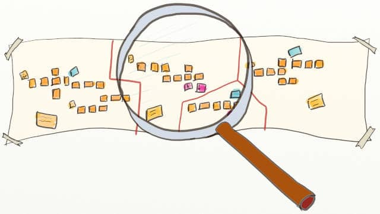

Imagine you are starting a new product with your team. You had been struggling for a while about how to start.

-   What should the high-level design be?
-   What should we focus on first?
-   What are the main risks?

All these questions remained unanswered until you heard about [Event Storming](https://www.eventstorming.com/)!

You decided to try [Big Picture Event Storming](##big-picture--why). As a result, you drafted a functional architecture vision in one or two (intense) days! That's more progress than you had made in weeks. Also, you managed to [identify the functional areas in your domain](#big-picture--functional-architecture). Then, you [have highlighted the topics you'll focus on to create your competitive advantage](#big-picture--build-or-buy). These are your core bounded contexts.

Everyone on the team now understands where to focus. So, finally, it looks like the teams are ready to start!

> 💡 Wait, how do you get from the Big Picture Event Storming to designing and writing software?

Event Storming has more to offer! We can zoom in with Design-Level Event Storming. We'll look into the following questions:

-   [What problems does Design Level Event Storming solve?](#design-level--why--problems)
-   [What are the outcomes of Design Level Event Storming?](#design-level--why--outcomes)
-   [How does Design Level Event Storming work?](#design-level--why--how-does-it-work)
-   [On which parts of your system should you run a Design Level Event Storming?](#design-level--why--parts)

::: {.sidenote data-latex=""}
📝 Big Picture Event Storming was about exploring [strategic and large-scale
Domain Driven Design](https://thedomaindrivendesign.io/what-is-strategic-design/); Design-Level Event Storming is about [small-scale DDD](https://thedomaindrivendesign.io/what-is-tactical-design/) inside a domain. Don't be surprised, but as you will see, the problems and outcomes are very similar, yet at a smaller scale and more fine grained.
:::

### What problems does Design Level Event Storming solve? {#design-level--why--problems}

It's a way to create a collaborative design with a whole software team to solve problems like:

-   **How can we make good enough design decisions in 1 day instead of months?**
-   **How can we be sure that everybody on the team understands our target design and pulls in that direction?**
-   **How can we leverage the perspective of everyone and not just of a few experts?**

### What are the outcomes of Design Level Event Storming? {#design-level--why--outcomes}

The Design Level flavor of Event Storming lets you **dive into the details of a [bounded context](https://martinfowler.com/bliki/BoundedContext.html)**. Its primary outcome is a good enough and shared design vision. Developers who attend the workshop should be able to start coding straight away.

During your Design Level Event Storming, you will:

-   Detail the information contained in domain events
-   Draft what the screens should display
-   **Identify potential services** in your architecture (aka Aggregates in DDD Vocabulary) and what they should do
-   Identify the need for interaction with external systems, which is the starting point for API design
-   Pinpoint critical issues: [the most pressing problems and the primary domain concept definitions](http://philippe.bourgau.net/5-views-to-capture-the-outputs-of-an-event-storming-workshop/).
-   Get the whole team to collaborate and design together
-   **Align all the team towards a shared vision**, which saves tremendous time as developers all nudge the code in the same direction!
-   Set the team on a sustainable pace by finding the perfect balance between [Big Up-Front Design and Emerging Design](#big-picture--why)!

::: {.sidenote data-latex=""}
📝  A **DDD Aggregate** is a small-scale programming pattern that recommends creating and destroying objects as grapes with a root.
:::

### How does Design Level Event Storming work? {#design-level--why--how-does-it-work}

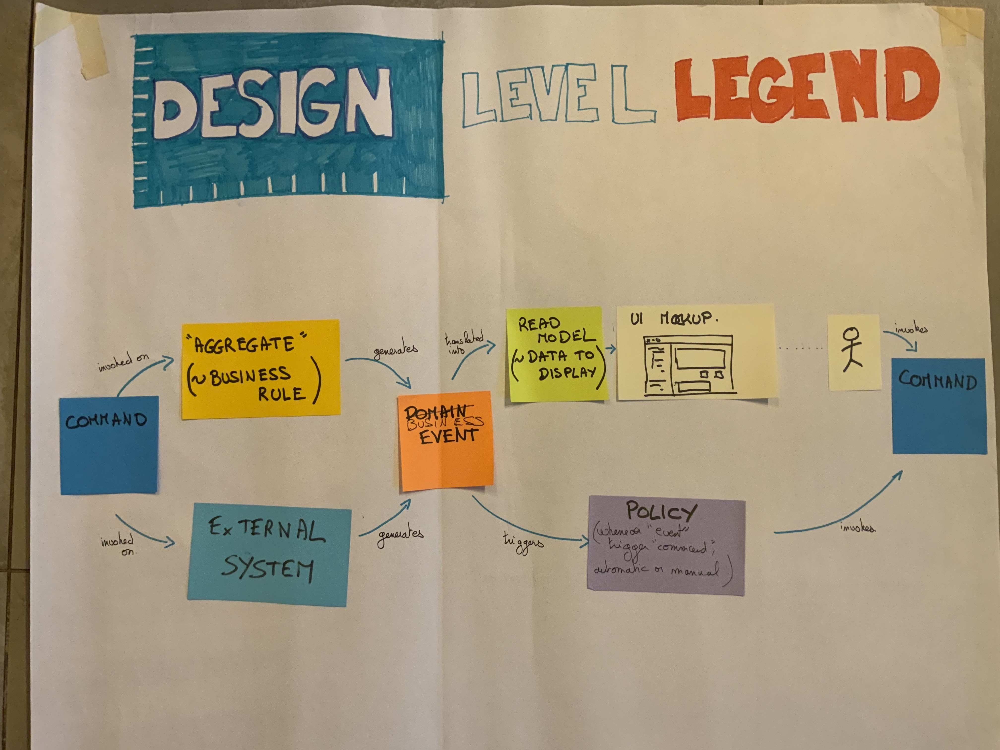
Source: [Introducing Event Storming](https://leanpub.com/introducing_eventstorming), [Alberto Brandolini](https://twitter.com/ziobrando).

**Similarly to Big Picture Event Storming, the Design Level flavor is a time compressor!** It relies on intense and high-bandwidth collaboration. It follows the same dynamic as Big Picture Event Storming, though it's a bit more detailed and technical.

### On which parts of your system should you run a Design Level Event Storming? {#design-level--why--parts}

Design Level Event Storming is a zoom-in, yet not all system parts require that much attention! Here are three pre-requisites to know on which parts of your system you should run a Design Level Event Storming:

-   First, you identified it as business-strategic and a business differentiator.
-   It's a real functional area about which developers and non-developers can talk and understand each other. It's not a technical brick that only developers can understand
-   It contains complicated domain logic that [deserves Domain Driven Design](https://stackoverflow.com/questions/27638513/when-we-shouldnt-use-domain-driven-design-approach%60) (ex: finance. If there are books written on this domain, it's a clue!)

These checks should look familiar if you ran a Big Picture Event Storming before! This is because they correspond to your core bounded contexts. **Design Level Event Storming is a natural continuation of Big Picture Event Storming.**

If you haven't run a Big Picture Event Storming before, as long as the previous checks are ok, Design Level Event Storming will work! You'll have to start with a fast "mini big picture event storming" on your scope. That's also a way to "redo" a quick Big Picture Event Storming to adjust as you progress.

Finally, Design Level Event Storming is particularly well suited to design microservice or [Event-Sourcing](https://martinfowler.com/eaaDev/EventSourcing.html) systems. If you plan to architect your system with these, that's yet another incentive to use Design Level Event Storming.

### Conclusion

If you have identified a functional area of your system that:

-   Is **A key business differentiator**
-   Contains **complicated domain logic** that deserves Domain Driven Design

Then run a Design Level Event Storming with the whole team which will build it! In a few hours:

-   **You'll make complex design decisions that would have taken months**
-   **You'll get a head-start on design**
-   **Everybody will be moving in the same direction**

We'll now explain how to facilitate your first Design Level Event Storming!

## How to explain Design Level Event Storming to your mother {#design-level--explain}

_Design Level Event Storming relies on advanced [Domain Driven Design](https://en.wikipedia.org/wiki/Domain-driven_design) vocabulary. Here is how to make things simple for your participants._

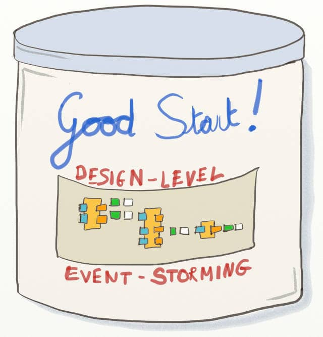

> I have a hard time remembering all these words like "Policies" and "Aggregates" (a participant)

> Sorry, Aggregates can only receive commands. They cannot emit any! (the facilitator)

> I'm sorry, I've lost track here. I'm kind of waiting for others to come up with something. (a participant)

Design Level Event Storming is finer grain and more technical than [Big Picture](#big-picture). It also relies on Domain Driven Design vocabulary to model technical concepts. The DDD jargon is precise but also challenging to grasp at first!

::: {.sidenote data-latex=""}
📝 [The first rule of DDD](https://philippe.bourgau.net/first-rule-of-ddd-is-lets-not-talk-about-ddd/): "Don't speak of DDD!"
:::

How can we provide essential DDD fluency to participants as we start the workshop? In a few minutes?

### "The picture that explains everything"

We briefly mentioned the "Picture that explains everything" in the previous chapter. [Alberto Brandolini](https://twitter.com/ziobrando) [introduced this picture](https://leanpub.com/introducing_eventstorming) to explain how to organize stickies.

Source: [Introducing Event Storming](https://leanpub.com/introducing_eventstorming), [Alberto Brandolini](https://twitter.com/ziobrando).

We find the name of this picture a bit misleading! From the puzzled looks of people, we can guarantee that this picture needs explaining!

Before you start the workshop, display the picture, and ask people what they understand. Some people might be able to explain parts of it to others. Finally, read the following explanation to ensure everybody starts from the same place.

### A speech to present Design Level Event Storming

> Alberto Brandolin, the inventor of Event Storming, calls this "The Picture That Explains Everything." It shows how DDD event-based systems work. In addition, it features all the possible arrangements of stickies we can use in the workshop.
>
> The goal of this Event Storming is to design our system with these arrangements.
>
> This poster explains how Domain Events cascade during the system's life.
>
> A **Domain Event** is simply something that happens in your system.

ℹ️ Participants must understand what domain events are. Refer to [What to say at the beginning of a Big Picture Event Storming](#big-picture--what-to-say) for more explanations.

> Let's start from the left of the picture. Commands are sent either to external systems or to our aggregates.
>
> A **Command** is an order sent to the system, often by a human, for example, when he clicks something. But it can also come from a policy, and we'll see that later.
>
> **External Systems** are any other computer systems outside your workshop's scope.

ℹ️ Look at the [Step-by-Step Guide to run your Big Picture Event Storming](#big-picture--guide) for more details.

> **Aggregates** is the code you will write to handle our critical business rules. An "Aggregate" aggregates the business rules related to a particular business concept. That might sound a bit blurry, but trust me, that's all you need to know to get started! Take it easy. You will understand Aggregates better as we go through the steps of the workshops.
>
> Both Commands and Aggregates then raise a domain Event.
>
> Some events will "automatically" trigger another command. We materialize this link through policies.
>
> A **Policy** is an automation rule. A rule of thumb is that it follows the pattern "Whenever \<domain event\>, Then trigger \<command\>." Policies can be implemented by code or by a human operator.
>
> We use lilac stickies for policies, like the one at the bottom right.
>
> Other events notify Actors.
>
> An **Actor** is a human that interacts with the system.

ℹ️ You can find more details about actors in [Step by Step Guide to run your Big Picture Event Storming](#big-picture--guide).

> Actors should be able to react to events by sending new commands. To do so, they'll need to see the correct information. That's the green read-model sticky.
>
> A **Read Model** is simply the list of all the information to display in the User Interface.
>
> We'll also have to display this information in a good UI. We can mock-up this UI in the white sticky.
>
> A **UI mock-up** sticky is simply a drawing of what the user would see.
>
> This brings us to the right of the picture. It ends as it started, with a command. That's how we can chain this picture to model the whole system.
>
> By the end of the workshop, the board should consist of many repetitions of this pattern.
>
> From now on, we should make everything explicit. Everything we say should appear on the board.

Leave the poster on the wall so participants can refer to it during the workshop. Adding a legend with the definitions is also a good idea.

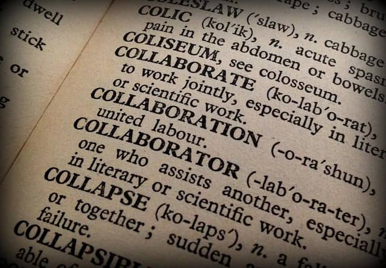

::: {.sidenote data-latex=""}
📝 **Whatever your issue, adding special stickies is usually a bad idea**

Before getting [Alberto’s advice about logging decisions](#big-picture--guide--reverse-storytelling--explicit-decisions), we tried using custom “decision” stickies. That did not work well. Event Storming already has an extensive color code for stickies; adding more is too much. (Note: It’s almost impossible to find a sticky color that is not already used, anyway!)

When we tried this, people would make decisions but forget to record them with stickies.

> 💡_If you are considering adding a new kind of stickies, look for another idea!_
:::

### You're ready!

That's all the definitions you need! Let's dive in a detailed agenda for the whole Design Level Event Storming.

## The Best Agenda For Design-Level Event Storming {#design-level--agenda}

_Use Design-Level Event Storming to identify Aggregates, UX mockups, and other design elements. Just follow this agenda through your first facilitation!_

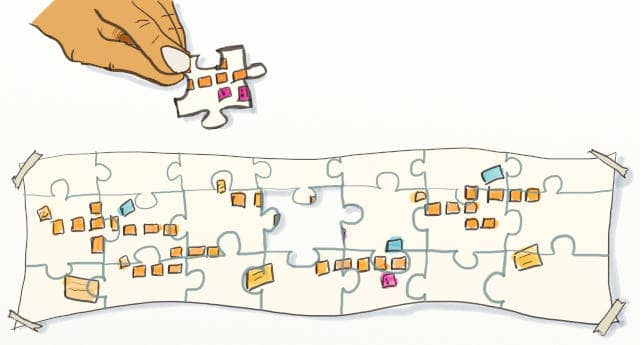

So, here you are! You have identified a business-critical bounded
context. (Remember, bounded contexts are just functional areas) It is
the perfect occasion to use Design Level Event Storming!

Let's see how to get started!

Big Picture is about exploring. Design-Level is about designing and
building.

Here is a detailed and step-by-step agenda that you can follow to
facilitate your Design Level Event Storming. You'll see that many steps
in the workshop are almost mechanical. So, follow the guide, and
everything will go well!

1.  [The target design](#design-level--agenda--target-design)
2.  [Domain Events](#design-level--agenda--domain-events)
3.  [Commands](#design-level--agenda--commands))
4.  [Actors and Policies](#design-level--agenda--actors-policies)
5.  [Blank read-models and UX mock-ups](#design-level--agenda--blank-stickies)
6.  [Read models and UX mock-ups](#design-level--agenda--read-models)
7.  [External Systems](#design-level--agenda--external-systems)
8.  [Blank Business Rules](#design-level--agenda--blank-business-rules)
9.  [Business Rules](#design-level--agenda--business-rules)
10. [Aggregates of Business Rules](#design-level--agenda--aggregates)
11. [Aggregates Names](#design-level--agenda--aggregates-names)

Let\'s take an example to illustrate how to run the workshop. Imagine
you are in a software company that builds a self-publish board games
website.

The website also lets people play their games online. In the examples
below, we will be running the Design-Level Event Storming on this \"live
game\" bounded context. It is one of many functional areas of the whole
system.

### The target design {#design-level--agenda--target-design}

Source: [Introducing Event Storming](https://leanpub.com/introducing_eventstorming), [Alberto Brandolini](https://twitter.com/ziobrando).

Before you start, you'll need to ensure that everyone understands what
Design Level Event Storming is about. Refer to our previous chapter, [How to explain Design Level Event Storming to your mother](#design-level--explain), for detailed
instructions to present the workshop and all the vocabulary.

The workshop will make the above pattern of stickies emerge step by
step.

### Domain Events {#design-level--agenda--domain-events}

The first thing you'll need in a Design-Level Event Storming is [domain events](https://martinfowler.com/eaaDev/DomainEvent.html)!

If you are running this workshop after a Big Picture Event Storming,
copy the events from the part of the system you are focusing on to
another blank design board. As usual, we are using orange stickies for
events.

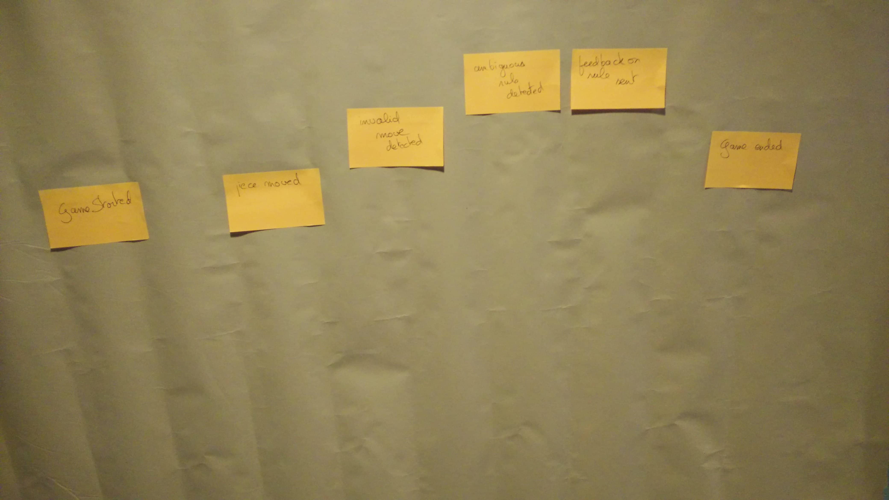

If starting from scratch, you will still need to generate events. You
can run the first steps of the Big Picture Event Storming on your
limited scope:

1.  Events Generation
2.  Events Sorting
3.  Actors and External Systems
4.  Storytelling

Check [A detailed agenda of Event Storming](#big-picture--guide) to
learn how to run these steps in detail.

### Commands {#design-level--agenda--commands}

The next step is to prefix every [domain event](https://martinfowler.com/eaaDev/DomainEvent.html) with a
blue [command](https://en.wikipedia.org/wiki/Command_pattern) sticky.
This step is straightforward: if you have an event called "Game
Started", prefix it with the command "Start Game". Sometimes, the
command names are a bit different, but you should manage to figure this
out.

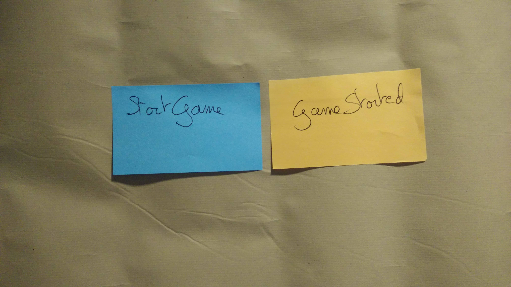

### Actors or policies {#design-level--agenda--actors-policies}

Commands can either be sent by a human
(an [actor](#big-picture--guide--actors-and-externals))
or automatically by a policy.

Go through all the commands and prefix them with an actor or a policy.

If you have been through a Big Picture Event
Storming, you should have identified the actors, so copy them.

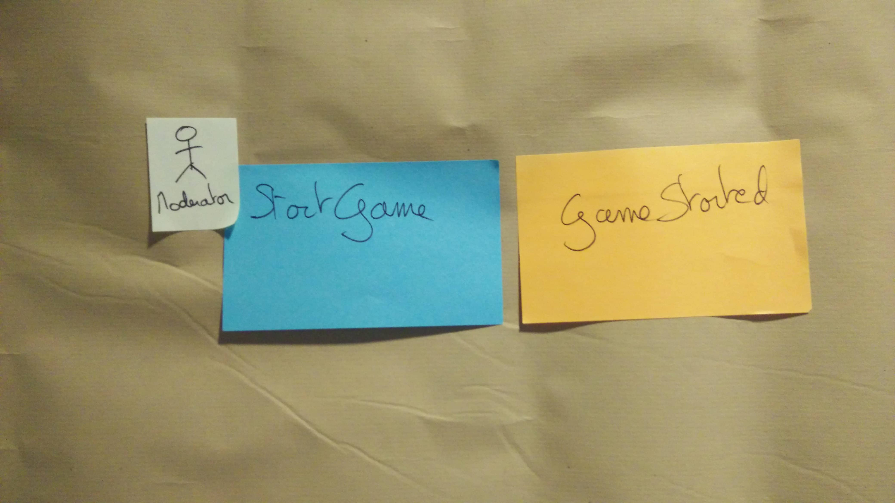

Actors should have a title, and policies should follow the form
"Whenever Event X, then Command Y."

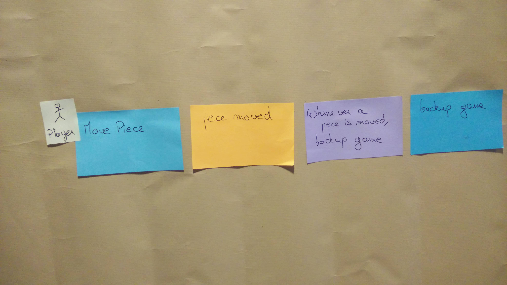

(Note: Policies are sometimes manually automated: a human does it. In
this case, it's simpler to keep modeling this as a policy rather than
introducing a 'dumb' actor)

### Blank stickies for what the actors will see {#design-level--agenda--blank-stickies}

Actors need information before they can send a command. So, again, we'll
use stickies for that!

Again, this step is a mechanic: add blank green and white stickies
between domain events and actors!

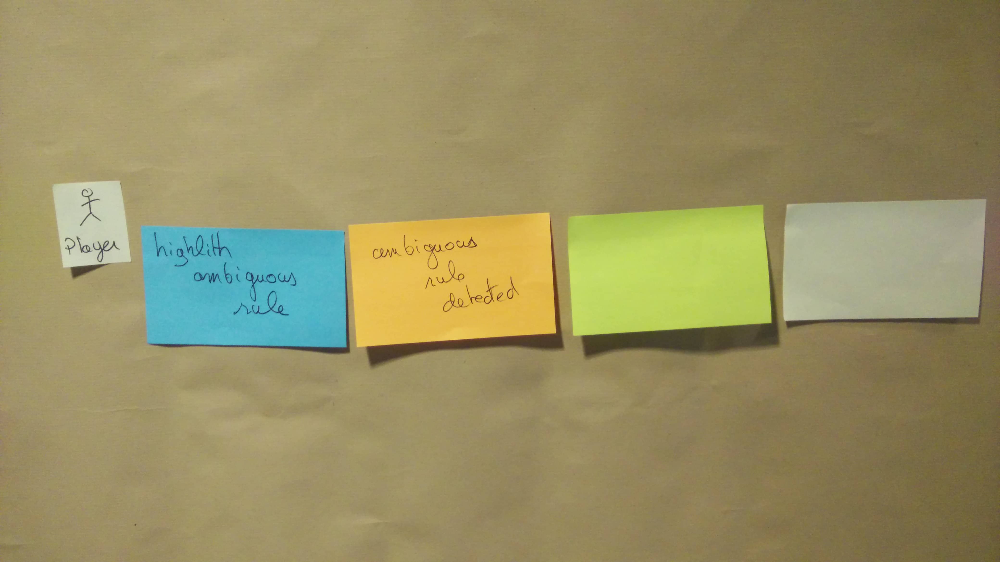

::: {.sidenote data-latex=""}
📝 **What does “Make the Design Space Infinite” mean in practice?**

> 💡_You need even more infinite design space for Design-Level Event Storming!_ 😉

Stickies are great because we can move them around many times. During Design-Level Event Storming, participants often insert new stickies between existing ones. They’ll need a bit more design space every time they do this, and that’s when ‘Infinite Design Space’ takes all its meaning. Another situation is if stickies start to be aligned vertically rather than horizontally. Remember that [Shared understanding relies on common metaphors](https://www.goodreads.com/book/show/34459.Metaphors_We_Live_By).

As the facilitator, you need to be proactive:

1. Pause the workshop
2. Explain the need for more space
3. Add more design space by claiming more of the wall (left, right, or even above or below)
4. Move the stickies to keep the design clear. It’s quick if you ask everyone to contribute.
:::

To Infinity and Beyond! By [Michele M. F.](https://www.flickr.com/photos/e-coli/), under [Attribution-ShareAlike 2.0 Generic (CC BY-SA 2.0)](https://creativecommons.org/licenses/by-sa/2.0/), original on [Flickr](https://www.flickr.com/photos/e-coli/10923806663)

### Read models and UX mock-ups {#design-level--agenda--read-models}

Let's list the information the actors need to send their commands.

::: {.sidenote data-latex=""}
📝 Design-Level Event Storming is the perfect workshop to discuss the UX of domain events
:::

1. First, write down the data you want to display on the green sticky.
This is a Read-Model.
2. Second, on the white sticky, sketch the user interface that will
display the data on the screen. This is a UX mock-up.

::: {.sidenote data-latex=""}
📝 **Optimize the time of Domain and UX experts**

Some steps of Design Level Event Storming are pretty straightforward, almost mechanic, they are mere pre-requisite to the critical steps: business rules and UX exploration.

These mechanic steps don’t need the experts. Also, we don’t want to waste their time. The simplest thing to do is get through these steps as quickly as possible. Explain what to do and ask everyone to take part. Don’t hesitate to timebox to one minute to get everybody to participate!

Finally, exploring the UX of all screens and Business Rules takes some time. If the group waits for [two specific people to discuss all the topics](#big-picture--guide--actors-and-externals--discussion-bottleneck), the workshop will take ages! This is the case of a single discussion bottleneck, and you need to split the group. Event Storming makes it easy to work in parallel! UX experts can work on UX while domain experts discuss business rules. With enough experts, you might have many groups working on UX or business rules simultaneously!
:::

### External systems {#design-level--agenda--external-systems}

You've been looking at what happens 'after' a domain event. Let's dive
into what happens between a command and an Event.

The "picture that explains everything" shows that [external systems](#big-picture--guide--actors-and-externals) also
raise domain events.

If you have done a Big Picture Event Storming before, you should have
spotted a few external systems. Copy them to pink stickies and stick
them between Commands and Events.

If you haven't gone through a Big Picture Event Storming before, go
through all commands and add pink stickies for external systems where it
makes sense.

In the scope of a bounded context, other contexts become external
systems too! Go through all the remaining commands. Add a pink sticky
between the command and the event when they involve another context.
Write the name of the other context on the pink sticky.

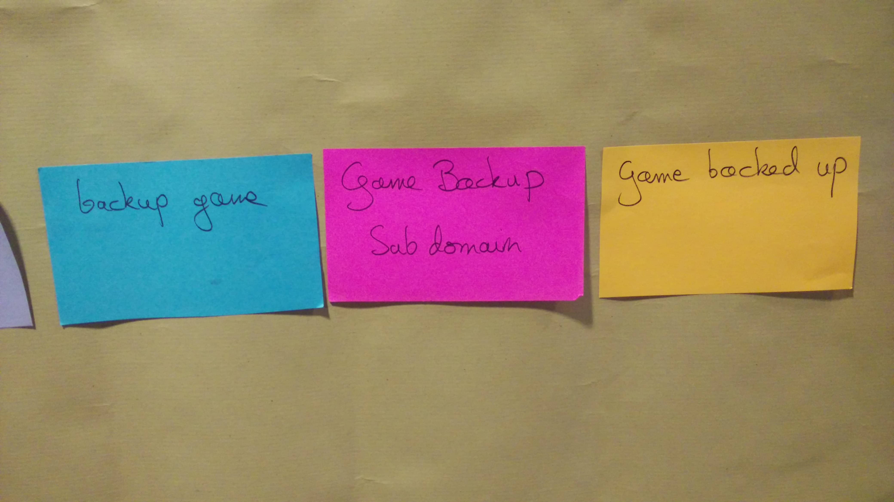

### Blank Business Rules {#design-level--agenda--blank-business-rules}

Here's another mechanical step. If an external system did not raise an
event, a business rule must have triggered it.

Go through all commands and events not linked by an external system. Add
an empty yellow sticky there.

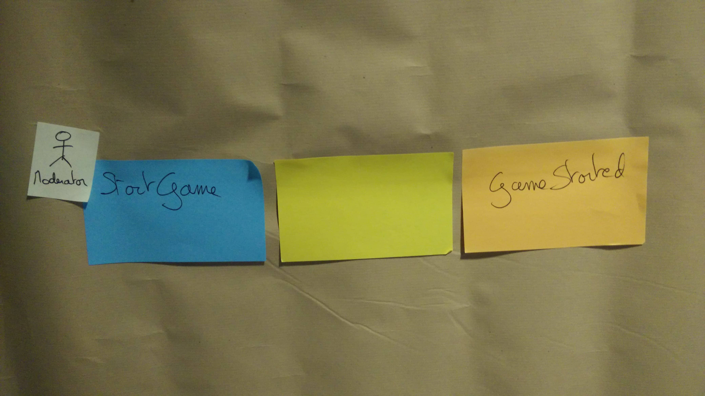

### Business Rules {#design-level--agenda--business-rules}

::: {.sidenote data-latex=""}
📝 Discussing Business Rules is the critical moment of Design-Level Event Storming
:::

Ask participants to fill in these business rules with what happens
during its execution:

-   What is true before (preconditions).
-   What is true after (postconditions).
-   What remains true all along (invariants).
-   Any additional information to clarify what the business rule does.

Some business rules are dead-simple, while others will trigger much
discussion. This knowledge-sharing between domain experts and developers
is invaluable.

::: {.sidenote data-latex=""}
📝 These conversations can be an occasion to use other practical conversation formats like [Example Mapping](https://cucumber.io/blog/bdd/example-mapping-introduction/)
:::

### Aggregates of Business Rules {#design-level--agenda--aggregates}

Up to here, you've always kept the chronology in the design. Now, you
will break this to get closer to code design!

When you spot two business rules that deal with similar data, move them
on top of one another. Your board should now look like that:

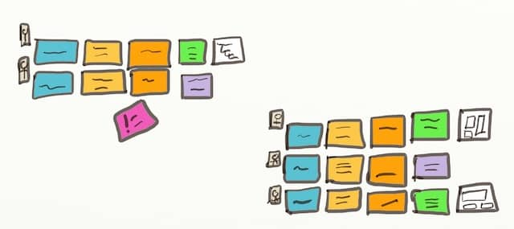

### Aggregates Names {#design-level--agenda--aggregates-names}

By aggregating business rules, you have formed Aggregates in the
Domain-Driven-Design sense!

::: {.sidenote data-latex=""}
📝 Finding good names for Aggregates is the last thing to do in a Design-Level Event Storming
:::

At this point, it should be easy to name your aggregates! So next, add
an extra yellow sticky on top of the aggregates to give the group a
name. For example, in the image below, the Aggregate's name is "Game."
This is because it groups two business rules that deal with game
workflow.

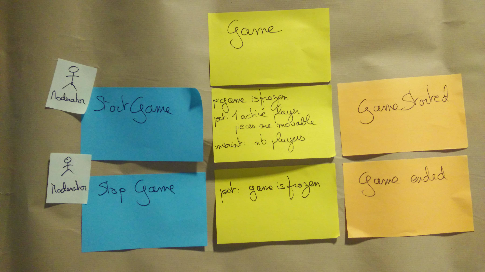

### That's all, folks!

You've reached the end of the workshop! As you've seen, Design-Level
Event Storming is very structured yet leaves space for critical
discussions.

To summarize, you started with the following:

-   An important bounded context
-   Some domain events in this context

And you ended up with:

-   Aggregates and business rules
-   Design mockups for user screens
-   Automation policies
-   A list of interaction points with actors and external systems
-   And the most essential thing: shared knowledge and understanding
    between everyone involved

You've learned everything there is to know
to facilitate your first Design Level Event Storming. If you have
already run a Big Picture Event Storming, there is nothing to be afraid
of here.

Send the invites, and get started!

## Design Level Event Storming 3-minutes summary {#design-level--3m}

_In this part, we went deep into the technical details. Let’s take a step back from Design Level Event Storming!_

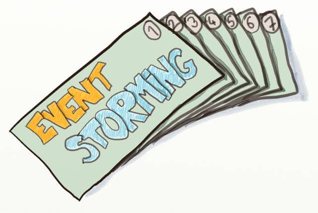

This chapter summarizes the key takeaways from all our previous chapters on Design-Level Event Storming and contains references about what to do after a Design-Level Event Storming.

### Why would you run a Design Level Event Storming?

In [Why Should You Run a Design-Level Event Storming](#design-level--why), we explained that **Design Level Event Storming bridges Big Picture Event Storming and actual coding with Domain Driven Design**. It should be used to zoom on the Bounded Contexts (aka Functional Area) of the system that:

- Are business-strategic and business-differentiating
- Contain complicated business logic, and as such, are worth a Domain Driven Design approach

### What is Design Level Event Storming

**Design Level Event Storming relies on precise Domain Driven Design concepts.** [How to Explain Design-Level Event Storming to Your Mother](#design-level--explain) contains a script you can use to introduce the necessary vocabulary:

1. The picture that explains everything
2. Domain Event
3. Command
4. External System
5. Aggregate
6. Policy
7. Actor
8. Read Model
9. UI mock-Up

### How to run a Design Level Event Storming

Finally, [The Best Agenda For Design-Level Event Storming](#design-level--agenda) is a detailed facilitation guide that walks through all the steps of the workshop:

1. Present the target design
2. Generate Domain Events
3. Add Commands
4. Add Actors and Policies
5. Add Blank read-models and UX mock-ups
6. Add Read models and UX mock-ups
7. Add External Systems
8. Add Blank Business Rules
9. Write Business Rules
10. Aggregate Business Rules
11. Find Aggregates Names

### Further Steps

**A question we have often heard at the end of an Event Storming workshop is, “So, what shall we do now? How do we keep track of this design?”.** Here are four strategies to close the workshop or move on.

#### Highlight the core subdomains

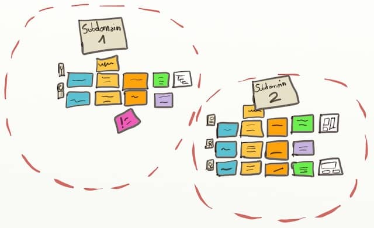

::: {.sidenote data-latex=""}
📝 Aggregates already group events together. Aggregates make it easy to draw subdomains.
:::

Here is a design quick-win you can do before everybody leaves the room. The bounded context you worked on might be large, and not all of it might be equally business-critical. So, **if you can spot areas of higher importance, everybody will know better where to focus their efforts!** DDD calls this the Highlighted Core. The smaller the core subdomain, the more precise the priorities will be.

#### Create curated views

Alberto Brandolini, the inventor of Event Storming, said its **actual outcome is in the participants’ shared understanding. This is true, but it might not satisfy everyone in your organization.**

A quick fix is photographing the design board and saving it in your knowledge base. Another is to stick the board in the team’s space. Yet, you’ll see that the design board will soon become obsolete!

A better way is to **capture focused views. For example, domain definitions, problems, and decisions can be collected through specific documents**. For more details, check out [How to Capture the Outputs of an Event Storming Workshop](https://philippe.bourgau.net/how-to-capture-the-outputs-of-an-event-storming-workshop/) and [5 Views to Capture the Outputs of an Event Storming Workshop](https://philippe.bourgau.net/5-views-to-capture-the-outputs-of-an-event-storming-workshop/).

::: {.sidenote data-latex=""}
📝 You can even push the curated views idea further and fill a whole [Bounded Context Canvas](https://github.com/ddd-crew/bounded-context-canvas). It's a precise set of views that, together, will give you a deep understanding of your bounded context.
:::

#### Run example Mapping

All the **business rules are great candidates for user stories.** [Example Mapping](https://cucumber.io/blog/bdd/example-mapping-introduction/) is a quick and structured conversation format for digging into the details of a user story. **Pick a business rule and run an Example Mapping session to turn it into a detailed user story with test scenarios and acceptance criteria.**

#### Build a walking skeleton {#design-level--3m--walking-skeleton}

::: {.sidenote data-latex=""}
📝 The best way to get more feedback after a Design-Level Event Storming is to try to build the design!
:::

Finally, the best way to get more feedback is to try your design! **Building a Walking Skeleton is the most effective way to learn more about your design.** A walking skeleton is a very minimalistic end-to-end implementation of your system or feature. Learn how to select what to put in your Walking Skeleton in [How to fight priority paralysis with Event Storming](https://philippe.bourgau.net/how-to-fight-priority-paralysis-with-event-storming-and-ddd/).

### Event Storming the Flow

Here you are: You went from a Big Picture idea to a functional architecture and then dived into the details of your core Bound Contexts. You harnessed collective intelligence and tackled a complex business problem to achieve this.

What if you tried applying this new skill to your workflow? We’ll see that in the next part, Event Storming the Flow. Read on!
