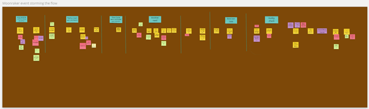
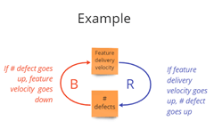

# Event Storming the flow
## Three questions to know if event storming the flow could help you {#Threequestions}
_Event storming can be used to improve the flow of work. Answer 3 questions to know if the technique is your go-to choice to address your workflow challenges._

### The story of a team that was performing

The Genesis team is working on a software product. The team was once famous for its capacity to respond to client requests extremely fast. Yet, during the last year, each time they received such a request, their work always ended up generating new issues: regressions on the existing code, workarounds that are more and more complex to find, more time dedicated to testing and fixing the regressions than to implement the actual solution.

Although Genesis team members still wished to answer client requests fast, it seemed that a mystery spell had been cast against them. **This situation felt as stressful as being trapped in an ever-growing snowball running downhill with no idea on how to stop it.** The more they wanted to bring back their capacity to respond to client requests quickly, the longer it would take them.

### The story of a team that was anticipating market needs

The Moonraker team is working on another software product. Not long ago, Moonraker people were assigned a task to anticipate a future market need, based on strategic analysis from product people in the management.

Moonraker guys started developing a new component (_let's call it 'error handling', although we don't really care about what it is for the purpose of this chapter_). It took them 1,5 years to design, build, and test the first version. The good news is that it coincided with the moment when the first client use case was identified. The bad news was that the volume of 'errors' that the 'error handling' component should have handled for this client was way higher than what it was meant to be. As the client use case needed to be covered quickly, **an architectural decision was made to have the client-facing team (another one) build a local workaround for this specific client**. Although the client would be satisfied, it was a 'cosmetic gesture'. The decision clearly acknowledged that some technical debt was created and would need to be repaid.

When a second client use case was identified, Moonraker people had started to work on other quite urgent stuff. Consequently, Moonraker could only dedicate time during the next 4 weeks to address this new request for the new use case. Although there were still some questions on the level of performance for error handling, the plan to dedicate a limited amount of time seemed acceptable, as the new request was documented with a design to implement. Moonraker people started to work right away. A commitment by the client manager was made to the new client.

We are now one week away to the delivery date. Moonraker people made assumptions with regards to the targeted performance level. They are under pressure to deliver on time, while still taking care of their other urgent stuff. They are raising the question. **What is the plan B in case we are late or our assumptions are wrong?**

### Why are these stories similar?

These stories have **three aspects in common**

1. **The problems that they describe are not about a lack of skills**

The skills, experience, and knowledge of the team members are unquestionable. The teams have all the necessary skills and experience to deliver the products they are working on.

2. **The problem persists**

In both cases, the sensation of a snowball running downhill is present. For Genesis, no matter what they do, it keeps taking them longer to answer client requests. For Moonraker, no matter what they do, they have difficulties to build a solution that corresponds to the needs. There is a risk for them to lose the trust of their stakeholders.

3. **There is no obvious solution**

When reading these stories, you probably identified a few possible dysfunctions. For example, Genesis probably did not take care of their accumulating technical debt early and continuously enough. Or they may do testing too late in their workflow. Moonraker started their new work assignment with no real client use case, which is probably a recipe for failure.

These hypothetical dysfunctions are probably real. Having said that, you can not be sure that these are the only dysfunctions or even the main ones. Besides, you can hardly know what may have caused these dysfunctions in the first place. And even if you could determine a clear set of causes, it is more valuable to identify what to do to change these dysfunctions than to identify their causes.

### What would an event storming the flow workshop bring?

When you do an event storming of the flow, you will visualize the events that occur during the flow of the work you are examining.

Then you will look for patterns and  [feedback loops](https://less.works/less/principles/systems-thinking).

From there, you will identify levers where to act.

This will allow you to you to identify actions. These actions aim at changing the system that creates the repetitive patterns resulting in the events. Starting with visualization and doing the next steps allow you dig into the system and to not stay on the 'apparent problems and solutions' that only contribute to perpetuate the snowball effect.

### How to know if Event Storming the Flow could help you?

In a nutshell, whether your team is working on a software or not, the typical situations in which event storming the flow makes sense are the ones where your answers to the 3 following questions would be no, yes and no:

1. **Is it a problem of skills?** _no_
2. **Has the problem been persisting or even growing despite the effort you or your team already put into solving it?** _yes_
3. **Is there one obvious solution?** _no_

If your answers correspond, read further and about Event Storming the flow and get ready to run this workshop on your own!

## Five ingredients to prepare before starting an event storming of your worksflow

_Event Storming the flow workshop requires 5 main ingredients in the recipe. Get ready to cook in this chapter!_

In the [previous chapter](#Threequestions), you answered 3 questions to know if Event Storming the Flow could help you.
You know the challenge that you are going to explore:
1. is not only due to a lack of skills
2. persists despite the effort already put into solving it
3. does not have an obvious solution.

Let’s get prepared for the workshop with these 5 ingredients:
1. [A flow to explore](#Ingredientflow)
2. [The right attendees](#IngredientAttendees)
3. [A workshop intent](#IngredientIntent)
4. [A briefing](#IngredientBriefing)
5. [A real use case](#IngredientUseCase)

### First ingredient: a flow {#Ingredientflow}

What is the flow that you will be looking at during the workshop? In other words, in which flow is the challenge embedded?

**A flow consists of a succession of activities linked one to another (think of an assembly line)**. Most of the work we do is part of a flow. In software development, this flow often includes design, test, development, and building activities.

The answer to the previous question goes like this: "from the moment when... till...".

### Second ingredient: the right attendees {IngredientAttendees}

You want to **invite**:
- the people **who do the work in the flow** that you identified in the previous question
- the people for **whom the problem is painful**
- the people **who are volunteering** to attend such a session. It means that they want to contribute to removing the problem.

You want to avoid:
- forcing people forced into the workshop
- for a problem that they don’t feel concerned about.

You also want to limit attendance to a decent number of people (10 is already a lot!).

### Third ingredient: a workshop intent {#IngredientIntent}

What would the participants like to achieve with this workshop? **Define this intent with as many attendees as possible.**

Ask them to answer questions such as: “What is the intent of this workshop? What do you want to achieve at the end of this workshop? How will you know that you achieved this result?”

**Unprecise intents such as “engaging people” or "improving collaboration" are worth further questioning.**

An intent is like a lighthouse for the workshop. It is necessary to know where to go. It needs to be precise enough to focus. And it needs to be flexible enough to be reached from any starting point. E.g.: “adapt the way we are working together so we have fewer late detections of bugs that provoke rework”.

It’s best when the intent somehow relates to the problem to solve.

### Fourth ingredient: an introduction of Event Storming the Flow in a few words {#IngredientBriefing}

Let's be honest, the name of the technique - event storming the flow - is not self-explanatory.

Yet, there is nothing complex about the technique. You can explain it in a few words:
-	during a 15min video call or
-	in a wiki page with examples or
-	in a short email.

Here is an example of the latter:

> Welcome!
>
>You are invited to a workshop called "Event storming the flow".
>
>What is event storming the flow?
>
>1. **It is a visualization technique** that has been used in the company on several occasions.
>2. It aims at **creating an aligned understanding of a workflow**.
>3. Once the alignment obtained, the technique allows the **improvement of the workflow**. For example: how to remove priority blockers? What are the sources of rework? When to take better decisions in our flow?
>
>What is going to happen during this workshop?
>
>**This is a collective workshop**, as the list of recipients of this email indicates.
>**We’ll use plenty of post-its** and follow some simple guidelines to visualize your workflow on a wall.
>To do this, you will select a real use case that is representative of what usually happens for this workflow.
>Then, based on this visualization, you will identify:
>- patterns you wish to remove from this workflow,
>- levers on which to act to drive the desired change,
>- and actions to perform.
>
>This is not one of these boring workshops. You will be actively contributing most of the time!

You can also:
-	add information about the timing, duration, and the number of sessions,
-	provide details about the use case (5th ingredient) or the workshop intent (3rd ingredient),
-	share this book, or a link to some posts from this blog that inspired the book!
Your goal is to **convert a name (event storming the flow) into an attractive promise for attendees**.

### Fifth ingredient: a real use case {#IngredientUseCase}

**The participants will bring a real use case as a starting point to describe the flow.**

Ask them for a **recent** feature or situation. It needs to be **representative of what usually happens in the workflow**.

Using a **real-life situation** is key to:
- **prevent theoretical discussion** about an imaginary situation
- **engage the participants** who can discuss a use case they know
- **identify a bounded scope** for the workshop
- check that you have **the right list of participants** to cover this scope

Having the use case before starting the workshop is not a must. Still, it is a good way to check the alignment of the participants.

It’s a good sign when several people identify one. Otherwise, it is an opportunity to take a step back and go back to the intent of the workshop again (3rd ingredient).

### Next 
If you follow these steps, your Event Storming the flow session is already on a good track! In the next chapter, we’ll see how to prepare the room for a successful session.
