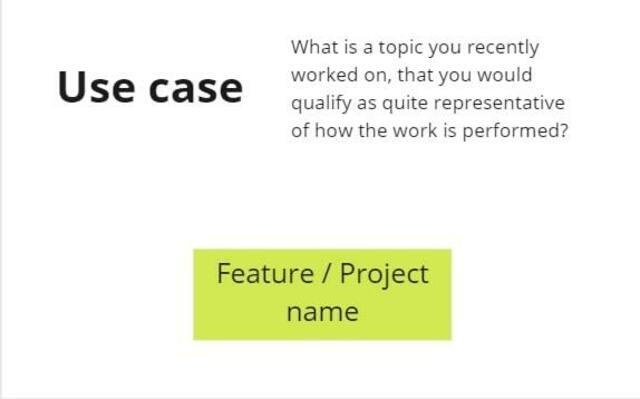
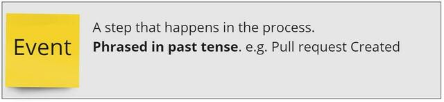
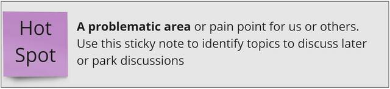
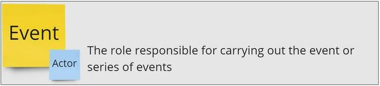
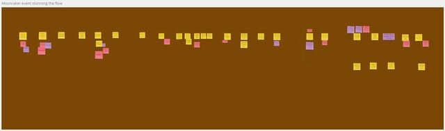
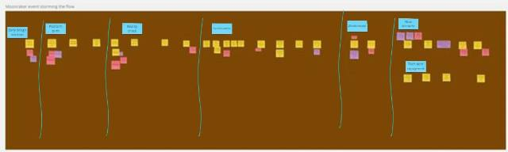
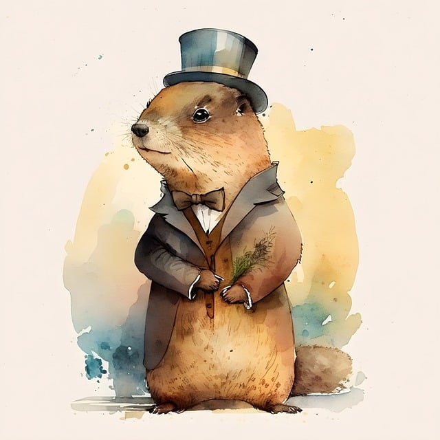
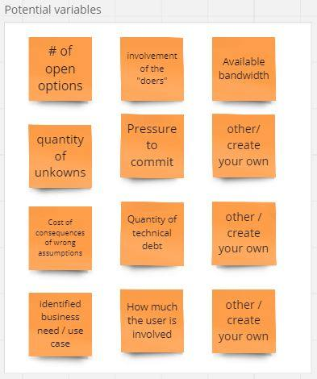
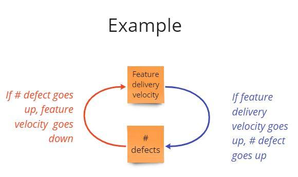
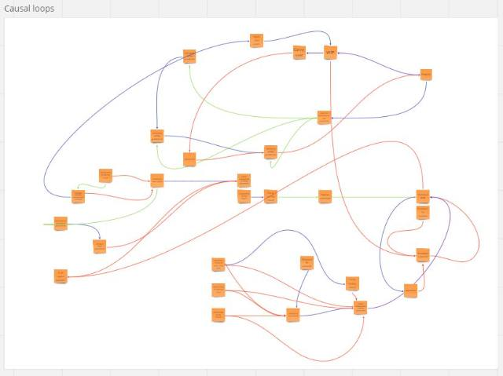

# Event Storming the flow {#Event-Storming--Flow}
## Three questions to know if event storming the flow could help you {#Threequestions}
_Event storming can be used to improve the flow of work. Answer 3 questions to know if the technique is your go-to choice to address your workflow challenges._

### The story of a team that was performing

The Genesis team is working on a software product. The team was once famous for its capacity to respond to client requests extremely fast. Yet, during the last year, each time they received such a request, their work always ended up generating new issues: regressions on the existing code, workarounds that are more and more complex to find, more time dedicated to testing and fixing the regressions than to implement the actual solution.

Although Genesis team members still wished to answer client requests fast, it seemed that a mystery spell had been cast against them. **This situation felt as stressful as being trapped in an ever-growing snowball running downhill with no idea on how to stop it.** The more they wanted to bring back their capacity to respond to client requests quickly, the longer it would take them.

### The story of a team that was anticipating market needs

The Moonraker team is working on another software product. Not long ago, Moonraker people were assigned a task to anticipate a future market need, based on strategic analysis from product people in the management.

Moonraker guys started developing a new component (_let's call it 'error handling', although we don't really care about what it is for the purpose of this chapter_). It took them 1,5 years to design, build, and test the first version. The good news is that it coincided with the moment when the first client use case was identified. The bad news was that the volume of 'errors' that the 'error handling' component should have handled for this client was way higher than what it was meant to be. As the client use case needed to be covered quickly, **an architectural decision was made to have the client-facing team (another one) build a local workaround for this specific client**. Although the client would be satisfied, it was a 'cosmetic gesture'. The decision clearly acknowledged that some technical debt was created and would need to be repaid.

When a second client use case was identified, Moonraker people had started to work on other quite urgent stuff. Consequently, Moonraker could only dedicate time during the next 4 weeks to address this new request for the new use case. Although there were still some questions on the level of performance for error handling, the plan to dedicate a limited amount of time seemed acceptable, as the new request was documented with a design to implement. Moonraker people started to work right away. A commitment by the client manager was made to the new client.

We are now one week away to the delivery date. Moonraker people made assumptions with regards to the targeted performance level. They are under pressure to deliver on time, while still taking care of their other urgent stuff. They are raising the question. **What is the plan B in case we are late or our assumptions are wrong?**

### Why are these stories similar?

These stories have **three aspects in common**

1. **The problems that they describe are not about a lack of skills**

The skills, experience, and knowledge of the team members are unquestionable. The teams have all the necessary skills and experience to deliver the products they are working on.

2. **The problem persists**

In both cases, the sensation of a snowball running downhill is present. For Genesis, no matter what they do, it keeps taking them longer to answer client requests. For Moonraker, no matter what they do, they have difficulties to build a solution that corresponds to the needs. There is a risk for them to lose the trust of their stakeholders.

3. **There is no obvious solution**

When reading these stories, you probably identified a few possible dysfunctions. For example, Genesis probably did not take care of their accumulating technical debt early and continuously enough. Or they may do testing too late in their workflow. Moonraker started their new work assignment with no real client use case, which is probably a recipe for failure.

These hypothetical dysfunctions are probably real. Having said that, you can not be sure that these are the only dysfunctions or even the main ones. Besides, you can hardly know what may have caused these dysfunctions in the first place. And even if you could determine a clear set of causes, it is more valuable to identify what to do to change these dysfunctions than to identify their causes.

### What would an event storming the flow workshop bring?

When you do an event storming of the flow, you will visualize the events that occur during the flow of the work you are examining.

Then you will look for patterns and  [feedback loops](https://less.works/less/principles/systems-thinking).

From there, you will identify levers where to act.

This will allow you to identify actions. These actions aim at changing the system that creates the repetitive patterns resulting in the events. Starting with visualization and doing the next steps allow you dig into the system and to not stay on the 'apparent problems and solutions' that only contribute to perpetuate the snowball effect.

### How to know if Event Storming the Flow could help you?

In a nutshell, whether your team is working on a software or not, the typical situations in which event storming the flow makes sense are the ones where your answers to the 3 following questions would be no, yes and no:

1. **Is it a problem of skills?** _no_
2. **Has the problem been persisting or even growing despite the effort you or your team already put into solving it?** _yes_
3. **Is there one obvious solution?** _no_

If your answers correspond, read further and get ready to run an Event Storming the Flow workshop on your own!

## Five ingredients to prepare before starting an event storming of your workflow {#FiveIngredients}

_Event Storming the flow workshop requires 5 main ingredients in the recipe. Get ready to cook in this chapter!_

In the [previous chapter](#Threequestions), you answered 3 questions to know if Event Storming the Flow could help you.

You know the challenge that you are going to explore:

1. is not only due to a lack of skills

2. persists despite the effort already put into solving it

3. does not have an obvious solution.

Let’s get prepared for the workshop with these 5 ingredients:

1. [A flow to explore](#Ingredientflow)

2. [The right attendees](#IngredientAttendees)

3. [A workshop intent](#IngredientIntent)

4. [A briefing](#IngredientBriefing)

5. [A real use case](#IngredientUseCase)

### First ingredient: a flow {#Ingredientflow}

What is the flow that you will be looking at during the workshop? In other words, in which flow is the challenge embedded?

**A flow consists of a succession of activities linked one to another (think of an assembly line)**. Most of the work we do is part of a flow. In software development, this flow often includes design, test, development, and build activities.

The answer to the previous question goes like this: "the flow that we will be looking at starts from the moment when... till...".

### Second ingredient: the right attendees {#IngredientAttendees}

You want to **invite**:
- the people **who do the work in the flow** that you identified in the previous question
- the people for **whom the problem is painful**
- the people **who are volunteering** to attend such a session. It means that they want to contribute to removing the problem.

You want to avoid forcing people into the workshop for a problem that they don’t feel concerned about.

You also want to limit attendance to a decent number of people (10 is already a lot!).

### Third ingredient: a workshop intent {#IngredientIntent}

What would the participants like to achieve with this workshop? **Define this intent with as many attendees as possible.**

Ask them to answer questions such as: “What is the intent of this workshop? What do you want to achieve at the end of this workshop? How will you know that you achieved this result?”

**Unprecise intents such as “engaging people” or "improving collaboration" are worth further questioning.**

An intent is like a lighthouse for the workshop. It is necessary to know where to go. It needs to be precise enough to focus. And it needs to be flexible enough to be reached from any starting point.
E.g.: “adapt the way we are working together so we have fewer late detections of bugs that provoke rework”.

It’s best when the intent somehow relates to the problem to solve.

### Fourth ingredient: an introduction of Event Storming the Flow in a few words {#IngredientBriefing}

Let's be honest, the name of the technique - event storming the flow - is not self-explanatory.

Yet, there is nothing complex about the technique. You can explain it in a few words:
-	during a 15min video call or
-	in a wiki page with examples or
-	in a short email.

Here is an example of the latter:

> Welcome!
>
>You are invited to a workshop called "Event storming the flow".
>
>What is event storming the flow?
>
>1. **It is a visualization technique** that has been used in the company on several occasions.
>2. It aims at **creating an aligned understanding of a workflow**.
>3. Once the alignment obtained, the technique allows the **improvement of the workflow**. For example: how to remove priority blockers? What are the sources of rework? When to take better decisions in our flow?
>
>What is going to happen during this workshop?
>
>**This is a collective workshop**, as the list of recipients of this email indicates.
>**We’ll use plenty of stickies** and follow some simple guidelines to visualize your workflow on a wall.
>To do this, you will select a real use case that is representative of what usually happens for this workflow.
>Then, based on this visualization, you will identify:
>- patterns you wish to remove from this workflow,
>- levers on which to act to drive the desired change,
>- and actions to perform.
>
>This is not one of these boring workshops. You will be actively contributing most of the time!

You can also:

-	add information about the timing, duration, and the number of sessions,
-	provide details about the use case (5th ingredient) or the workshop intent (3rd ingredient),
-	share this book, or a link to some posts from the [Event Storming Journal](https://eventstormingjournal.com) blog that inspired the book!

Your goal is to **convert a name (event storming the flow) into an attractive promise for attendees**.

### Fifth ingredient: a real use case {#IngredientUseCase}

**The participants will bring a real use case as a starting point to describe the flow.**

Ask them for a **recent** feature or situation. It needs to be **representative of what usually happens in the workflow**.

Using a **real-life situation** is key to:

- **prevent theoretical discussion** about an imaginary situation

- **engage the participants** who can discuss a use case they know

- **identify a bounded scope** for the workshop

- check that you have **the right list of participants** to cover this scope

Having the use case before starting the workshop is not a must. Still, it is a good way to check the alignment of the participants.s

It’s a good sign when several people identify one. Otherwise, it is an opportunity to take a step back and go back to the intent of the workshop again (3rd ingredient).

### Conclusion 
If you follow these steps, your Event Storming the flow session is already on a good track! In the next chapter, we’ll see how to visualize a workflow.

## The steps to visualize your workflow with Event Storming {#flow--steps}

*When you have recurring problems with how work is performed, Use Event Storming to model your workflow. It is the first step to changing the status quo.*

This chapter is a step-by-step guide to running your event storming the flow. Go straight to the [steps](#the-step-by-step-guide-to-model-your-workflow-with-event-storming) if you are short on time.

Read the whole chapter to discover:

-	The typical situations where Event Storming the flow is a good fit
-	Why visualization works great 
-	Why Event Storming the flow is an awesome technique

### Typical situations for which Event Storming the flow is a good choice
In [a previous chapter](#Threequestions), you read the stories of 2 teams creating software and having problems doing so. These problems:

1.	were not about skills

2.	were persisting over time

3.	had no obvious solution

### Visualization? Why?

These situations are complex as there is no obvious causality of the problem.

> In complex situations, a good first step is to start with a visualization of your workflow.

This means modeling and visualizing what usually happens (events) on a timeline. When you do so:

1.	You focus on facts, not theories or opinions

2.	You start with a description of a situation to understand the problem. You don't state the problem by the lack of one’s favorite solution. e.g. “the problem is we don’t spend enough time on [_whatever_]” or “the problem is we have no contact with [_whoever_]”

3.	You create the possibility to ask: “what made us get there?” and “what is working fine, that we could use as a basis for future progress?”

Thus, visualization:

-	helps you find the right actions
-	and decreases the likeliness of making the wrong decisions.

### Why Event Storming?
Event Storming is a very good technique to visualize your workflow because:

1.	You do Event Storming with the people who do the work described in the workflow. And it is a collective activity.

2.	An Event Storming of a workflow starts with a real-life use case. It neither describes a theoretical, nor an ideal succession of steps.

Read more about the benefits of using Event Storming for visualization in [this blog post](https://philippe.bourgau.net/event-storming-lessons-from-post-it-haters/)

### The step-by-step guide to model your workflow with Event Storming{#the-step-by-step-guide-to-model-your-workflow-with-event-storming}

#### Preparation

-	Gather [the 5 ingredients to prepare your event storming the flow](#FiveIngredients)

-	Find [the ideal room to run the workshop](#Ideal-room)

-	And [prepare the room](#big-picture--room)

#### Find a use case to describe

You can identify this use case before the workshop or at the beginning of it.
To do so you can ask this question:

>What is a topic you recently worked on, that you would qualify as quite representative of how the work is performed in this team / area / department?

Usually, people mention examples like “the [_feature name_]” or “when we did [_a project requiring a significant effort_]”

Whatever the use case is, you want the workshop participants to consider it representative. If someone proposed the use case before the workshop, ask the following question at the start of it:

> Do you consider this use case representative of how the work usually happens in this team / area / department? If not, what alternative use case would you propose to explore?

Sometimes, you will have to cover several use cases. Each represents a different workflow that usually takes place in parallel in real life.

In this case, model these workflows in parallel on the visual board.

#### Identify an event

Ask people to identify something that happened during this workflow. Give an example such as “feature inserted in the backlog” to show that an event is expressed in passive form and past tense.

You only need an event to start. Write Events on orange stickies.

#### Identify more events, collectively

1.	First individually (4’), then in pairs (4’) , then in groups of 4 (5’), ask people to identify more events on stickies.

2.	When discussing in small groups, they should remove duplicates, clarify wording, and start sticking the events chronologically

3.	Together (5’), invite people to remove duplicates again and align the consecutive events on a horizontal line. If the workflow includes optional paths or alternatives, they should be placed on another parallel horizontal line. Do all this in silence.

4.	Then inform the participants that this is the first draft of the visualization. Not everything is clear yet. Some words may be confusing. But the goal is to draw the whole picture before going into details. So, ask people:

    -	“What is missing to complete the picture? Are there some gaps in this workflow representation?”
    -	“Are there events that occur before or after that have a significant impact on this workflow or that this workflow impacts?”

If the answer is yes, do another iteration starting from 1

At this stage, you will have to ask that someone tidy things up a bit: realign stickies, remove stickies that placed randomly… It should take 2 to 3 min at most. It is better to ask someone than to do it yourself. Do not neglect any opportunity to make the group responsible for their work.

By the way, if you wish the group to feel in charge, benefit from  concrete advice by visiting this blog post: [Engage the participants during your next Event Storming thanks to the Delegated Missions](https://www.eventstormingjournal.com/foundations/engage-the-participants-during-your-next-event-storming-thanks-to-the-delegated-missions/) presents a good approach ("the delegated missions") to do so. It is called the delegated missions. 

#### Identify hotspots and actors collectively

##### What are hotspots?

Hotspots are spots of the workflow that are hot 😉. Write hotspots on red stickies. People will identify with these stickies:

1.	Things that are not clear (e.g. the meaning of a word)

2.	Questions (e.g. “How was this decision taken? By whom?” “How long did this step take?”)

3.	A problematic area or pain point (“This puts more pressure on the teams”)

4.	They may also write down suggestions (e.g. “what if we had done this with our product owner involved?”)

The goal of sticking a hotspot is to flag that something needs discussion or to park discussions for later.

##### What are actors, and external systems?

Actors are the people who contribute most to the occurrence of an event or a chain of events. Use small blue stickies to identify actors and stick them on the 1st event.

You can use the same stickies to identify interactions with external systems, sources of information, or people.

##### How to identify hotspots and actors?

1.	Split your attendance into 2 groups.
2.	One half identifies actors while the other identifies hotspots
3.	5’: ask people to identify hotspots or actors individually and in silence without sticking them yet
4.	5’: in small groups of 3 or 4, people share their list, remove duplicates, refine, and stick their actors or hotspots.
5.	Switch the groups. The group who was on hotspots goes to actors and vice-versa
6.	2’: ask people to individually look at what was previously displayed
7.	3’: back in small groups of 3 or 4, people remove duplicates they see and enrich the initial list with their contribution if they want to add any hotspot or actor

#### Final check

You should now have a representation of the workflow that looks something like this:

But before going further:

-	Re-confirm the use case is representative of the usual workflow by asking the question: 

> Now that you represented the use case, would you still say that it is representative of how the work is performed in this team / area / department? Or would you suggest another more representative use case?

- Check the picture encompasses enough of the system by asking:

> In the next steps we are going to identify improvements and challenge how the “system” works. How representative of the whole system is this visual? Would you advise adding more steps to the left or to the right to enable us to be bold in the next steps?

These 2 checks can open the door to going back to more visualization activity.

### Conclusion and next

Once you visualize the workflow you are one step further toward alignment on the problem.

What you already achieved with the group is:

1.	a shared understanding of how work is performed. This resolves lots of opinion-based debates.

2.	an identification of what is not explicit enough (hotspots).

You also opened the possibility of broadening the boundaries of your actions. You can enable the diagnosis, based on something tangible.

We will explain how in the [next chapter](#flow-metaphors).

_In case you are wondering, you can do all the above remotely. We will come back to this in a [future chapter](#remote-event-storming)._

## How Metaphors can help you focus and succeed in Event Storming {#flow--metaphors}

_You modeled your workflow with Event Storming. Now use a metaphor to give a name to this model. This chapther explains how and why this is good practice._

A picture is worth a thousand words.

When it comes to understanding complex business processes, a metaphor can be worth millions.

[The previous chapter](#flow--steps) describes the steps to visualize a workflow with Event Storming. The resulting visualization looks something like this.

Let’s call this visual model the “Big Picture”.

It is now time to take a step back to digest what you see.

You can do this in 3 steps:

1.	Identify the main steps of the workflow on the Big Picture.

2.	Get insights from looking at this enriched Big Picture .

3.	Give a title to your Big Picture.

These simple steps are describe below.

Putting a title to your Big Picture is an easy and fun activity that brings important benefits. You can read the list of them [at the end the chapter](#flow--metaphor-benefits). For example, having a title allows you and your team to name what it is that you want to avoid.

But let’s first go back to the Big Picture.

### One.-	Identify the main steps of the workflow on the Big Picture

Start by asking the participants to:

-	Find clusters of events that fit well together.

-	Define a name for each of these clusters of events.

-	Draw a vertical line between each step. They can use tape or draw lines on a digital tool.
Now, your Big Picture  should look something like this:
 

### Two.-	Get insights from looking at the Big Picture.

The previous step made the Big Picture more digestible. Now that it has some structure, it is easier to step back and not get lost in the details.

Ask the participants the following questions:

> What are you noticing? What does this picture show? What are your thoughts and feelings? What seems to be a recurring pattern? Where do you see activities that create unproductive results?”

Give them 3 minutes to think alone, then ask them to join in a group of 2 or 3 and discuss their thoughts for 5 minutes.

Once done, ask the whole group to voice some of the things that they shared in their discussions. Don’t let this go on and on. Timebox this discussion to 5 minutes max and try to get as many different inputs as possible.

### Three.-	Pick a title

Now comes the fun  part!

Use the following prompt:

> Based on your discussions, now find a name for your Event Storming. It can be a name you invent, a song title, or the title of a famous movie. Be creative and have fun!”

Ask participants to think alone for 1 min. Then, in groups of 3, ask them to come up with a proposal and stick it on the wall.

Use dot voting to select the best proposal. Ask participants to:

> Select one of the proposals. Pick the one that you would mention, to remember what you want to stop! For example, you could say: “guys, we are doing [ title ] again”.

_Back to the Future, Groundhog Day, and Highway to Hell are classical choices!_

 
### Four.-	Why is this activity useful? What are the benefits? {#flow--metaphor-benefits}

Giving a fun title for your workflow may seem trivial. Yet, having a name to refer to, that represents what you want to avoid is very useful for several reasons:

1.	You can mention it when falling back to the undesired pattern.

2.	It builds a common language over what your group wants to avoid.

3.	With a song or movie name, you do not make a drama of the undesired situation but rather make fun of it.

4.	The simplicity of the metaphor prevents digging further into the analysis.

This 4th benefit is key as, at this stage of the Event Storming, what you want to do is to start looking for possible ways to improve your workflow.

How to do this? Keep reading! This is what we will discuss in [the next chapter](#flow--vicious-circles)!

## How to discover the wicked vicious circles in your workflow?

*Stuck in repetitive workflow issues? Learn to spot and fix vicious cycles with this practical guide.*

### Vicious circles?

It was during last Christmas lunch, or during any Sunday family event. Your uncle Dave and your brother-in-law Bob started to discuss. The discussion was about Covid (or the education system, or the level of taxes, or the choices of the national football team coach). What you clearly remember is the overheating tone and the strong opinions that would never converge.

You can see the picture, right? We all witnessed such an opinion-based conversation… And let us be honest, we even took part in one of them. Most of these conversations go nowhere.

Yet, what they illustrate is the following: we all think we excel at knowing “what the real problem is”.   We all believe we are excellent at identifying root causes of dysfunctions. Every one of us has an opinion about “why things are not working properly”.

The truth is, we are quite good at finding causes of dysfunctions. Yet, while each root-cause contributes to a dysfunction, there are plenty of causes to problems  that are complex by nature.
So, we all can point at one or two causes and easily think is THE problem. But what if there were plenty of root causes, and what if they were highly interrelated?

This is what is happening when you are on a journey to improve your workflow: 
-	You want to identify the root causes of the dysfunctions and fix them. 
-	The bad news is that there is more than one root cause. There are plenty of them. 
-	And the worst news is these root causes are all linked. 

Fortunately, this chapter shows you how to visualize links between the many causes and consequences. In case you want to know, this visual representation mobilizes basic concepts of systems modelling. But don’t worry and keep reading, it is simpler than what the name indicates! 
 
 [Visualizing your workflow](#flow--steps) is an entry door to identifying the vicious circles in your workflow. Remember the overheated conversation between Dave and Bob. The vicious circle probably started when Dave answered Bob with a strong opinion-based statement, to which Bob counter-attacked, making Dave pump up the volume, etc.

Here, you have what is called a causal loop: a cause, creating an effect that becomes a cause  to another effect and so on, in a loop. 

We call this type of causal loop a vicious circle because it has undesired effects that often persist over time.

Causal loops are present in your workflow. Let’s see how to identify them.

Here are the steps:

-	Step 1: Introduce the concept of _Variables_ 

-	Step 2: Have the participants identify the variables of the workflow. 

-	Step 3: Introduce the concept of _causal loops_. 

-	Step 4: Create a simple causal loop diagram.

Let us detail each of these steps.

### Step 1: introduce the concepts of variables.

For example, you can say: 
> “Variables are characteristic elements in your workflow that can change or impact the overall process, for example:
> -	Number of people involved.
> -	Time to take a decision.
> -	Time to get feedback.
> -	Time to correct.
> -	Work in progress.

Variables are things that you can measure or observe. They can be quantities, duration. They can also be information in a broad meaning, or characteristics of relationships.

They influence how your workflow operates. We use variables to help us understand the different factors at play in your workflow."

### Step 2: Have the participants identify the variables in their workflow .
As you introduced the concept of variables, now ask the participants to identify the variables for the workflow.

-	Give them 5 minutes alone to list these variables on stickies. 
-	Ask them to join in groups of two for 5 minutes. 
-	You can potentially do another round by having groups of two merge to form groups of four. 
-	Have them display the list of stickies on the wall.

> Tip: if participants get blocked at the start, show them a list of potential variables, for inspiration.

At each round, ask participants to:

-	Remove duplicates.
-	Clarify the name if it is not self-explanatory. 
-	Check that all variables can be measured or observed. Reformulate and find the variable otherwise. 
-	Extend the initial list.
Ending up with a list of 5 to 15 variables sounds realistic.

### Step 3: explain the concept of causal loops.

A bit of storytelling is welcome here:

> “Suppose you invest one hundred € on an account with a 5% annual interest rate. After a year you own 105 €. After 2 years you own 110.25 €, etc. The more you invest, the more extra capital you get. And the more extra capital you get, the more you can invest. It is a **reinforcing** loop.

> Let us take another example. In a retail store, as stock levels decrease due to sales, the store places orders to restock inventory. It is a **balancing loop**. Less stocks -> More orders -> More stock

> Reinforcing or (positive feedback loops) can lead to exponential growth or decline, while balancing loops (or negative feedback loop) tend to maintain stability. They often interact.”

 

### Step 4: Create a simple causal loop diagram.

Your role now, as a facilitator, is to have participants draft causal feedback loops between the different variables they identified in the previous step.
To do this, our advice is to do an example with them.

Pick a variable from their list randomly. Suppose you pick “Work in Progress”.

Ask them:

> “if you have more Work in Progress, what other variable will be affected?”. “Time to correct a defect” could be one.

Then ask them:

> If “Time to correct” is higher, what will increase? They will probably say “Work in Progress”, or something else.

Use the color coding from the previous image. Red for reinforcing loops, blue for balancing loops, green when the direction is unknown

In small groups of 3 to 5, ask participants to continue this activity by adding variables and relationships.

The goal of this activity is not to reach the perfect model of their workflow. Systems modeling is a whole discipline that we are simplifying for our purpose.

Yet, you will quickly observe each group adding variables, loops, and a shared visual taking shape.

Once this happens, ask participants to check that the links they placed are as direct as possible.

Ask them to erase the ones that could be more direct, or to identify new intermediate variables.

> If “A” indirectly affects “C”, would there be an intermediate variable “B” between “A” and “C”? For example, between “Work in Progress” and “Time to correct a defect”, there could be an intermediate variable “Time to acknowledge the defect”.

As mentioned, the goal is not to reach perfect accuracy of the model. The [next chapter](#flow-levers) explains how to identify the levers to act upon. You will understand the value of having a “good enough” model when reading it.

### Bonus extra step: Take a step back and have participants share their learnings at this point.

At this stage, participants may already have come to striking realizations while stepping back on how their work is organized.

The high inter-relatedness of root causes is likely to be one of them!

If you feel the energy is a bit low in the room, give participants 1 min to individually identify their learnings at this point, and ask a few of them to share their reflections. This usually boosts the energy to continue.

## Identify where to act to improve your workflow {#flow-levers}
## Event Storming the flow 3-minutes summary {#flow-3minutes}
