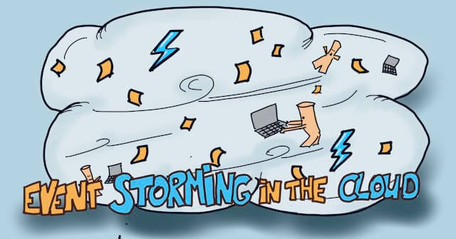
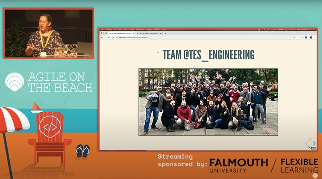
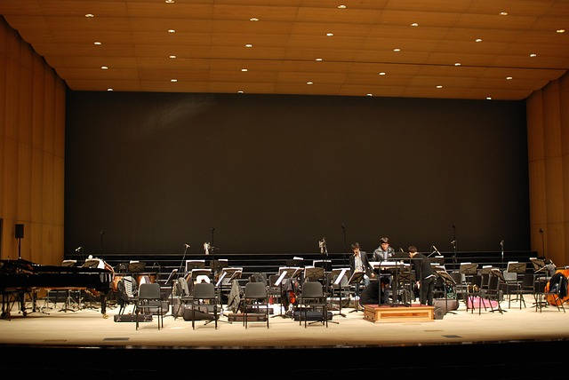
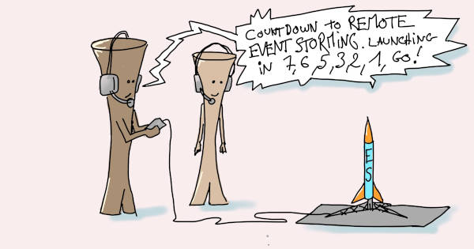
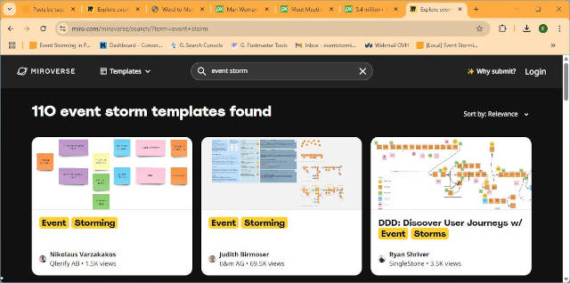
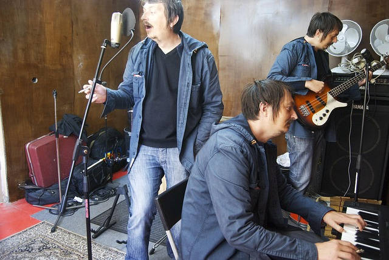
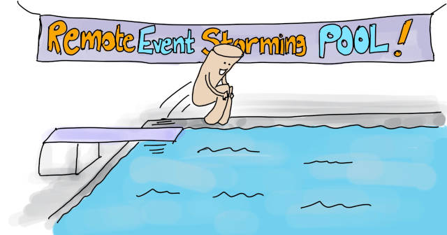

# Rethinking Event Storming in Remote {#remote-event-storming}

## Why Go Remote with Event Storming? The Surprising Benefits

::: {.lead-statement data-latex=""}
ℹ️ **In this chapter:** _Co-located Event Storming can be a real logistics challenge. Let's see how the remote alternative not only save time and money, but can also improve outcomes, inclusivity, and facilitation!_
:::

> Let’s run our ES at the next company yearly retreat… That is in 9 months!” Wait a second, wasn’t Event Storming supposed to speed up decision-making?

Let’s not kid ourselves; since COVID, hybrid work has become the default. Many teams are now distributed, and there are always people working from home. **Running an Event Storming with everybody at the same place and time has become a real challenge**.

At first, we were skeptical about adapting the workshop to remote. Yet, as we experimented, we discovered remote Event Storming had many great benefits. With good preparation, your results will be at least as good as when co-located.

### Why run an Event Storming remotely?

#### The shortcomings of co-located Event Storming

First, in-person Event Storming comes with a lot of practical constraints:

- Your team might be spread over many places, maybe in different countries. Organizing to get everyone at the same place and time adds waste:
  - **Traveling and accommodation** will cost money and organization time.
  - You'll have to schedule a few weeks in advance to accommodate everyone’s agenda. This will delay the decisions you can make in the workshop!
- The situation is not that much better if you all work at the same place! People might work from home regularly, so you'll still have to organize around this.
- Finally, co-located Event Storming logistics might be problematic. For example, finding an adequate room in your office can be difficult, so you’ll need to rent a place!

#### Doing Event Storming regularly

**In a hybrid world, remote is the only option to leverage Event Storming as a regular practice**. For example:

- Co-location is a real constraint if you want to run a quick refresh to finish a task or feature.
- Or if you want to integrate Event Storming as a quarterly practice.
- Here's another: you’ve just finished a co-located [Big Picture Event Storming](#big-picture). You’ve decided to follow up with a [Desing Level](#design-level). Unfortunately, everyone is already returning to their homes!

### Remote ES as an opportunity

#### The obvious advantages

Let’s start with the obvious: without travel and a big room to rent, remote Event Storming is

- **Cheaper**.
- **Greener**.
- And it saves you from all the physical setup of an in-person Event Storming.

#### Running Event Storming regularly

With **lower preparation time and budget**, you can run Event Storming more regularly! As mentioned above:

- “Refresh” your Event Storming every quarter.
- Dive into a bounded context with [Design-Level](#design-level) at [the last responsible moment.](https://blog.codinghorror.com/the-last-responsible-moment/)

#### Leverage digital tools

Then, remote workshops rely on two main tools: a virtual whiteboard (Miro, Mural…) and videoconferences (Zoom, Teams…). These tools come with **plenty of built-in digital benefits**:

- A persistent design board.
- “Real” infinite design space!
- The board is easy to export or copy, which enables sharing with a larger community.
- We reuse and improve board templates from one workshop to the next!
- It’s possible to record the sessions to archive how we arrived at some decisions.
- New AI features are appearing, like summarizing stickies or capturing transcripts of workshops.

#### More Time for Deep thinking

In-person Event Storming is an intense face-to-face communication exercise. Remote Event Storming, however, gives more space for other ways of thinking. As a facilitator, you can leverage this! For example, by asking: “Before the next session, can anyone find an answer to the question raised by this hotspot sticky?” In more detail:

- It leaves **more time for solo and deep thinking**.
- Asynchronous “research” reduces communication bottlenecks (when everybody listens or waits for someone else).

#### More inclusive

Finally, **remote is more inclusive!**

- Some people need specific equipment to work. Others have difficulties in crowded places. Remote help these people take part in the workshop.
- Letting everyone contribute harnesses **neurodiversity, which improves collective decision-making**.

> _If you have someone in your team with a disability, just adapt the work environment so they can do their job. For everything else, keep it exactly the same. In the Paralympics sports, adapting to the environment means we compete among people with similar disabilities. For the rest, we do exactly the same as any other high-performing athlete who would have no disability._ - Marie-Amélie Le Fur, President of French Paralympic committee.

#### Remote Event Storming will make you a better facilitator

Remote Event Storming will also benefit you as a facilitator. **Remote facilitation will teach you lessons you can also apply when co-located!**

For example, we had to learn how to give more explicit instructions. Once we took on this habit, we discovered it also improved our co-located sessions!

Here is another example: energy often dips during the Storytelling phase. When co-located, we accepted it as a necessary step in the workshop. In remote, it always happens and destroys people’s attention. So we combined breakout rooms for different board areas with “Shift and Share.” (Shift and Share is an organized way for all groups to visit the other rooms). This also improves the workshop when co-located, especially with a large audience!

### So, what are the limitations of remote Event Storming?

#### Reduced Team building

There are plenty of tips to make remote Event Storming more fun and make people feel connected. Yet, it’s impossible to reproduce the same human bonding experience as when we all are in the same room.

A co-located workshop, where everyone tackles the same challenge, is excellent for team-building! It’s often also the occasion to go outside and eat together.

[Watch the full talk](https://youtu.be/ZtsroDkCcRs?si=_vkn2aaK5cpre4U-)

#### No self-organization

Event-Storming participants naturally self-organize in smaller groups to tackle the different subjects. People will walk around, read what’s on the board, bump into each other, and start discussing stickies. Unfortunately, this will not happen when remote. These sub-group discussions will need to be explicitly facilitated! This is the primary rule of remote facilitation:

> 💡**What was implicit needs to become implicit!**

That’s why remote Event Storming facilitation is not easy! It will need more preparation, structure, and guidance. Yet, don't worry, we have your back! The following chapters will guide you through facilitating a remote Event Storming.

### Embrace remote Event Storming

The in-person Event Storming experience, intensity, and team building are irreplaceable. Yet, our practice shows that doing it remotely is possible. Remote Event Storming compensates with unsuspected benefits. With good preparation and adaptation, remote Event Storming rocks! Let's see how to facilitate it.

## Simplify Remote Event Storming With 7 Essential Practices  {#remote-event-storming--7-practices}

::: {.lead-statement data-latex=""}
ℹ️ **In this chapter:** _Here are 7 fundamental practices for remote Event Storming that increase delegation, reduce fatigue, improve documentation, and boost autonomy for any workshop._
:::

We just mentioned a key rule of remote facilitation: **“What is implicit must become explicit!”. As a facilitator, you must take the extra step to trigger collaboration that would naturally happen if people were co-located**. For example, you cannot bring beverages and food to the workshop and expect people to take some when needed. Instead, you’ll have to explicitly ask them to gather some at their desks from the beginning!

Here are seven essential practices that make the implicit explicit when running an ES in remote:

1. Split into short sessions
2. Regularly break out into topic rooms
3. Assign collaboration roles
4. Merge work with Silent Sorting
5. Keep the board self-explanatory
6. Make participants practice first
7. Find a Co-Facilitator

Let’s now see how to use these 7 “explicit” practices for real!

### Split into short sessions

Having everybody for two days in a co-located Event Storming is incredibly effective. It’s also quite exhausting! Trying to mimic the same focus remotely will leave everybody on their knees. There is no way a human can sustain their attention through a screen for 8 hours.

So, **book short sessions! We recommend 1h30 sessions**. For example, instead of a two-day workshop, schedule daily sessions for two weeks or twice daily for one week. As mentioned in the previous chapter, this lets you leverage the time between sessions by:

- Asking participants to look up more data.
- Adapting the workshop agenda.

### Regularly break out into topic rooms {#remote-event-storming--7-practices--breakout-rooms}

One of the great forces of Event Storming is that unique groups of people emerge to tackle the problems at hand. How can we replicate this in a remote setting?

We can use the [Open Space activity](https://www.liberatingstructures.com/25-open-space-technology/) to make the group creation explicit. It’s composed of two phases:

1. The pitch: anybody can propose and present “room” topics
2. The breakout: participants join whichever room they want

You can find more details about how to run a remote Open Space on [Philippe’s blog](https://philippe.bourgau.net/how-to-run-a-remote-first-open-space-technology-un-conference/). **The idea for remote Event Storming is to run every session (as described above) as an Open Space**. The typical Open Space has no pre-defined goal; one of its rules is “Whatever happens is the right thing.” However, as an Event Storming facilitator, you have a goal and an agenda! You will need to twist the Open Space so that people follow the Event Storming steps:

1. For some phases of the workshop, you will be prescriptive about room topics
2. You will organize knowledge sharing between rooms after every breakout
3. You will need some follow-up about what happens in the room

In more detail:

1. **Gather and share the workgroup topics**. And, at first, be prescriptive about the room topics. Yet, let people suggest their topics more and more as you progress through the Event Storming. You will need a visual marketplace to list the topics.
    - At the beginning, split the board by zone (example: left, middle, right). Each room can focus on one part of the board.
    - Later, split by functional area and associate each room to one or more areas.
    - At the end, let people come up with their topics.
2. **Let people self-assign to the various workgroups**. In the beginning, insist on having similar-sized groups. Become less and less strict as topics emerge from the participants.
3. **Let them work in breakout rooms**. And visit the groups to make sure things are going well.
4. **Organize a [Shift and Share](https://www.liberatingstructures.com/11-shift-share/)**. Leave an “owner” in each room, and ask the others to “visit” the other rooms for a chat. This will cross-pollinate all the knowledge that emerged from the different rooms. Learn more about facilitating this on the Liberating Structures website.
5. **Gather follow-up stickies**. Collect pink “problem” stickies from all the rooms. In this setup, it’s also a good practice to do the same with “decision” stickies: we use green ones. Collect them in a central space. Problem stickies are great candidates for room topics in the next session.

We find this sequence of activities central to facilitating a remote Event Storming. Once in place, **this rhythm becomes the “pulse” of the Event Storming**.

Side note: you can reuse this structure for many collaborative design activities!

### Assign collaboration roles {#remote-event-storming--7-practices--collaboration-roles}

In a co-located Event Storming, there is only one role aside from facilitator: participant. Everybody should create stickies and change the design board.

Here’s a story from the first remote Event Storming we facilitated. After a few sessions, we realized that, with their computers at their fingertips, participants were not as engaging as we were expecting. A small group was running the show while others were taking a backseat. The overall experience was slow and exhausting. We decided to start the next session with a mini-training about [Delegated Missions](https://www.metasysteme-coaching.fr/francais/coaching-et-management-d-equipe-les-processus-delegues/). We explained to participants that they had to self-organize with these roles in the work groups. It tremendously improved the workshop: participants improved their feedback on the sessions, and we were progressing faster!

> I had a glimpse at the epiphany of remote work. (feedback from a participant at the end of the workshop)

**Small work groups are already making things better. Let’s go further by assigning explicit participation roles**. Here are two schemas that work well; pick the one you feel most at ease with:

#### Option 1: The “mob”

This one builds on the rules of Mob Programming. You can find the details of this technique on [Nick Tune’s blog](https://medium.com/nick-tune-tech-strategy-blog/remote-team-flow-eventstorming-for-retrospectives-a8ea33cdb277). The roles are:

- One Storyteller who says what happens in the domain.
- One “facilitator” takes notes with stickies and ensures the session is on track.
- The other participants (the “Mob”) can interrupt, ask questions and give feedback.

They should switch the roles every few minutes; a timer is useful!

#### Option 2: The Delegated Missions

This one is slightly more involved but also more collaborative. Matthieu wrote a [complete guide about it](https://www.eventstormingjournal.com/foundations/engage-the-participants-during-your-next-event-storming-thanks-to-the-delegated-missions/). Here, different people take on different roles for the five ingredients of collaboration:

- The facilitator: structures the interactions and finds volunteers for the other roles
- The timekeeper: gives rhythm and makes sure things happen on time
- The intent keeper: shares the goal and makes sure the workshop progresses towards it
- The decision pusher: triggers decisions
- The meta feedbacker: shares feedback and improvement options based on their observation

They can keep the roles for the duration of a breakout.

### Merge work with Silent Sorting {#remote-event-storming--7-practices--silent-sorting}

We commit to recombining the results when we break out into topic rooms. You don’t want a single person to read through everything while everyone else listens. **Silent Sorting is a recombining practice that does wonders in remote**. It’s one of the few practices that works better remotely than in person! Here is how its magic goes:

1. Give a few minutes for everyone to silently read through what the others created
2. Still silently, ask everyone to move any sticky to organize them in a coherent whole
3. Finally, let people discuss the problematic points.

This works well to recombine work on different parts of the design board. It also works well to merge the output of various groups working on the same task. Here are some examples:

- At the beginning of the workshop, we create sub-groups to sort events chronologically. When the groups join, use silent sorting to organize all the events in a coherent timeline.
- There is a step to flag the bounded contexts as generic, supportive, or core. People do this alone, in pairs, small groups, and all together. At each step, silent sorting is used to merge the design of the smaller groups.

### Keep the board self-explanatory {#remote-event-storming--7-pratices--tidy-board}

To participants, breakout work implies that a lot happens in “other rooms.” The primary way to catch up is by reading the board. Keeping the board clear saves plenty of questions and answers.

So, as much as possible, **strive for a self-explanatory design board**. Explain this to participants. Repeatedly remind them to make the board easy to understand. As a facilitator, play "the silliest person in the room,” ask questions, and clarify the board.

If it feels worth it, you can also ask all participants to take 5 minutes of all-hands "tidy the board" time. Propose they add clarifying notes as they go. If needed, they can add questions on pink stickies.

### Make participants practice first {#remote-event-storming--7-practices--practice-first}

The good practices for a remote or co-located workshop are different! **Intense remote collaboration is something new to most participants. Make the participants practice these workshop techniques before starting the actual Event Storming!**

Do you remember our above story with Delegated Missions during our first remote Event Storming? Getting our audience to practice for 10 minutes was key to giving the participants the autonomy to use the techniques.

Here are three of the above techniques that are worth practicing before:

- **Group forming.** Make them practice a loop of Open Space, Shift & Share, and stickies collection.
- **Roles.** Get them through a co-creation activity, using the mob or delegated missions roles.
- **Synthesis.** To merge, get them through a co-design activity using the 1-2-4-all scheme and Silent Sorting.

It's also worth practicing technology and setup:

- An **online whiteboard tool** ([Miro](https://miro.com/), [Mural](https://www.mural.co/), …). Even if the tools are relatively intuitive, they take a bit of practice to use very well. For example, how to “follow” someone else, hide cursors, and navigate quickly…
- Finally, practice is a way to test the **physical setup** of each participant. We recommend two screens:
  - one with the online whiteboard
  - and another with the videos of the participants.

You can make them practice for 5 minutes at the beginning of each session. You'll have to split the full practice depending on what will happen next. You can also make them practice all the above in advance. This could be a sort of “mini-training” for remote workshops.

### Find a Co-Facilitator

You might be wondering:

> All this remote facilitation might seem like more work. How will I manage it all?

You don’t have to! **Get a co-facilitator or even many co-facilitators**. This has plenty of benefits:

- Share the workload
- Be present in different breakout rooms at the same time
- Keep the board tidier
- Make sure that participants follow the proper collaboration patterns
- Provide a different perspective
- Avoid mistakes by asking your co-facilitator, “Do you have anything to add? Did I forget anything? Did I get it all right?”
- Have a pair to discuss how to adapt the workshop between sessions

Finally, not doing this alone is also more fun and less stressful!

### The benefits of making the implicit explicit

At first sight, all these practices might seem cumbersome, unnatural, and extra work! Yet, when paying closer attention, they maximize the overall value of the workshop.

#### For the facilitator

For example, work should be more sustainable during the workshop itself:

- You will **delegate much facilitation** to the participants and your co-facilitator.
- Also, **short and regular sessions** save us from the two-day Event Storming marathon.

#### For the participants

These practices increase the workshop’s return on investment for participants:

- The explicit facilitation will make participants more autonomous. Meaning they will be more capable of **running an Event Storming by themselves** in the future
- Keeping **the board tidy and explicit is self-documentation**. Take a snapshot to record the workshop output.

#### Finally, for the organization

Making the Event Storming explicit will turn it into a learning experience!

- Participants will learn **reusable remote workshop skills**. This will make them more effective in their day-to-day work!

### Do you feel ready?

These techniques are the essence of effective remote facilitation! Do you feel ready to run your first remote Event Storming? If so, go ahead! Otherwise, read-on, we will go through the agenda in detail and dig into specific aspects.

## Your Step-by-Step Guide to Remote Event Storming {#remote-event-storming--step-by-step}

::: {.lead-statement data-latex=""}
ℹ️ **In this chapter:** _This is your 13 steps walkthrough to run your remote Event Storming. From logistics to Storytelling and beyond, through pre-facilitation and Events Generation: just follow these steps for a successful workshop!_
:::

The previous chapters covered the fundamental principles and practices of remote event Storming. If you are new to remote workshops, you might wonder:

> In practice, I still don’t how to run a remote Event Storming! I need final guidance to organize and run my first workshop.

Now is the time to get more concrete!

💡Just follow this step-by-step guide!

### Preparation {#remote-event-storming--step-by-step--preparation-guide}

Before you launch your remote Event Storming rocket, check these pre-flight essentials!

#### ⏹️Get the right tool

You need **a tool with an “Infinite design board” and a great user experience**. We’ve had success with Miro. Mural also has a good reputation. Here are alternatives you should AVOID:

- Online Slides. You can run successful remote workshops with online slides like Google Slides. Yet, these tools lack an “infinite design board” of Event Storming.
- Microsoft Whiteboard’s UX is too clumsy (at the time of this writing) to run a long workshop like Event Storming.

#### ⏹️Find a co-facilitator

The ideal partner would be:

- Experienced
- Enthusiastic
- Has already facilitated a remote Event Storming!

If you cannot get this rare gem, try to get someone with some of these characteristics! **Enthusiasm is the most important**: someone whose communicative energy will keep participants engaged. Also, **avoid getting someone with some critical knowledge** required for the workshop. For example, a key business expert should focus on the workshop content!

#### ⏹️Book the ES sessions

We recommend starting with **five sessions of 1h30, once or twice a day**. Also book five follow-up placeholders to activate later. In total, this amounts to 15 hours. More work will also happen between sessions as you assign homework to participants. There is no rule about how long the Event Storming will take. It varies depending on the scale of the problem space and how deep you want to go. Later, **add or remove sessions depending on how you are progressing**.

#### ⏹️Prepare the board

Before running the session, you will need to prepare a virtual board. The easiest way is to **start from a template**. You can find some good ones on your online whiteboard tool. Here are [templates for Miro](https://miro.com/miroverse/search/?term=event+storm). You will have to edit the template to fit your specific needs. Remember, it should be **as self-explanatory as possible**. Make sure that:

- You lock the background! You don’t want the design board to move whenever someone makes a bad move.
- It contains workshop instructions. Most templates already have this 😀.

Don't hesitate to embed tool usage documentation for the main actions:

- Creating a new sticky
- Zooming in and out
- Hiding cursors
- Following someone
- Bringing everyone to me
- ...

#### ⏹️Rehearse

We encourage you to **rehearse facilitation before your first remote Event Storming**. Find a group of **Event Storming enthusiasts** and give it a try. Make it as close as possible to the real thing. They don’t have to be participants in the Event Storming you are planning. They don’t have to be plenty either:

- 10 is ideal for testing the “large group dynamics,”
- But a rehearsal with four people remains very valuable.

Alberto used to use a food delivery service startup as a problem space in his masterclass. This is excellent because everybody understands it, and it features many different roles.

#### ⏹️Send invites

The invitation should be the same as for a co-located Event Storming (see [previous chapter](#big-picture--prepare--invitation). It should also contain extra instructions for tools setup, though:

> **⚠️ Take A Moment To Setup Your Technical Environment!**
> 
> A reliable technical setup is crucial for the remote Event Storming to function well. Please follow these steps before the workshop:
>
> - Install the online dashboard tool Miro (or Mural, or whatever)
> - Make sure you have a quality webcam so that others can see your non-verbal communication
> - Make sure you have a quality sound setup. We need to all hear each other clearly, without background noise. We recommend a quality headset or booking an isolated and calm room.
> - Make sure to have a solid Wi-Fi or cable internet connection during the sessions.
> - Attend the technical pre-session to:
>   - Discover how the workshop will unfold
>   - Verify your technical setup
>   - And practice some critical remote collaboration tricks.

#### ⏹️Run a first “get ready” session

Before starting the actual Event Storming, **run a setup session**. The goal is to make sure that all participants are ready for the workshop:

- Check that all participants managed to get their environment ready.
- Verify that everyone can connect to the design board
- Verify that everyone has a well-functioning webcam and headset
- Go through a mini-course about how they will collaborate during a remote workshop. As we explained in the previous chapter, the main points are:
  - Forming breakout groups
  - Using facilitation roles
  - Designing collaboratively with 1-2-4-All and Silent Sorting
- Finally, run a business briefing from sponsors and a workshop agenda presentation

Don’t run this session too much in advance; otherwise, people will forget!

### The Workshop

Your first remote Event Storming will feel like jumping into the swimming pool to know if you can swim! Don’t worry, though; with this guide, you will discover that you have a foothold!

Here is a remote Event Storming agenda, with detailed facilitation instructions. Follow the guide, and it will go well.

::: {.sidenote data-latex=""}
📝 What follows builds on previous chapters that you could read for a refresher:

 - [Step by Step Guide to run your Big Picture Event Storming](#big-picture--guide).
 - [Remote Event Storming Simplified: 7 Essential Practices](#remote-event-storming--7-practices)
:::

#### ⏹️Welcome

There are two extra points of attention when running Event Storming remotely:

- **Ask participants to turn on their webcams**. Depending on the culture of your organization, you might need to insist! You can use something like that: “90% of Event Storming is about collaboration, and 60% of collaboration is non-verbal. So please turn on your webcams. Poor internet connection is a valid excuse, but it’s the only one!”
- Do a last call to ensure that everybody’s technical setup is working (check the [above](#remote-event-storming--step-by-step--preparation-guide) for details)

#### ⏹️Events Generation

This phase is solo work. It works almost as if co-located. The only difference is the usage of virtual stickies instead of paper.

#### ⏹️Sorting Events

This is when the collaboration starts! It’s also when you will use the [seven essential practices of remote Event Storming](#remote-event-storming--7-practices).

- First thing: if you haven’t done it before, it’s the **last opportunity to run a [collaboration practice session](#remote-event-storming--7-practices--practice-first)**.
- To smooth out the sorting, you’ll need to split the participants into [breakout rooms](#remote-event-storming--7-practices--breakout-rooms):
  - Create arbitrary subgroups of 3 and ask them to **sort their events using [Silent Sorting](#remote-event-storming--7-practices--silent-sorting)**.
  - If you have more than 15 participants, add an extra round of intermediate breakout rooms. You'll need to merge three subgroups of three into groups of nine manually. Then ask them to silent sort again.
  - When you call everyone back together, **give participants a moment to review the work of other groups silently**. Continue with [Silent Sorting](#remote-event-storming--7-practices--silent-sorting) and only then open the discussion to complete the board.
  - Throughout, **visit the rooms** to monitor participants' progress and provide guidance as needed. (See the [Delegated Missions or the Mob Roles](#remote-event-storming--7-practices--collaboration-roles) from the [7 Essential Practices](#remote-event-storming--7-practices).)
- Finally, as events find their place, make sure to [keep the board tidy](#remote-event-storming--7-pratices--tidy-board)

#### ⏹️Adding Actors and External Systems

This step is typically **brief and straightforward**. In the spirit of [Silent Sorting](#remote-event-storming--7-practices--silent-sorting), ask everyone to add Actors and External Systems to the design board. After a moment, ask participants to voice questions, disagreements, and counterproposals.

#### ⏹️Storytelling

The co-located way of **walking through the design board all together is a pain when remote**. Here is an alternative flow using subgroups.

- Split the participants into [breakout rooms](#remote-event-storming--7-practices--breakout-rooms) according to the timeline. Create **separate rooms for each board section** and ask people to self-assign. It implies extra setup and facilitation: this is when a co-facilitator is helpful.
- End the breakout-room time by asking each group to come up with:
  - **Pink stickies for problems and questions**.
  - **Green stickies for decisions**.
- Run a [Shift and Share](#remote-event-storming--7-practices--breakout-rooms) so that each group has the opportunity to visit the rest of the design board
- Finally, copy all the problem and decision stickies into two dedicated boards and take a short moment to review them.

You can use a similar approach when doing Reverse Storytelling.

#### ⏹️Follow up activities

From this point forward, the agenda for the event storming is more adaptive. Orient the workshop to **different activities depending on what is most valuable**. Some activities have their built-in workflow; in this case, stick to it. Otherwise, use [breakout rooms, problem and decision stickies, and the Shift and Share flow](#remote-event-storming--7-practices--breakout-rooms). This is an excellent alternative to having everybody listening to a central “driver”. As the facilitator, it’s up to you to decide what topics the breakout rooms should have:

- You can use **sections of the board**, roughly following the timeline (for example, Storytelling)
- **Pink “problem” stickies** make great topics! A session of fixing pink stickies can be pretty effective.
- It can be a **pure open space**, where anyone pitches their topic for their room.
- It can also be a mix of the above: **an open space with a few pre-defined topics**.

Finally, here are two last advice to remember:

- Don’t forget to use [Silent Sorting](#remote-event-storming--7-practices--silent-sorting) whenever subgroups have to merge their work.
- Visit the breakout rooms to make sure they are effective.

### Benefits

Again, the main benefit of following **this workflow is stressless facilitation** because you'll know that you:

- Won’t forget anything. You can use this chapter as a reference walkthrough for remote Event Storming facilitation.
- Will follow the good practices of those who battle tested remote Event Storming before you
- Will save work by reusing invitation and board templates.

As a bonus: this workflow makes some practices (ex: Reverse Storytelling) even better than when co-located!

### You are ready!

This is all there is to know to run a remote Event Storming! If you haven’t yet, you can send your invitations and start the preparation.

In the following chapters, we will delve into the advanced challenges of remote facilitation. How to leverage the small sessions? How to keep people engaged?

## Leverage splitting a session in small chunks in remote
## How to keep people engaged in a remote Event Storming
## Remote Event Storming in 3 minutes