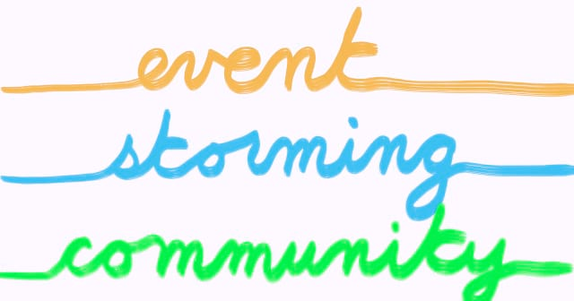

# General tips for Event Storming

## The ideal room for your in-person Event Storming {#Ideal-room}

::: {.lead-statement data-latex=""}
ℹ️ **In this section:** _How to make sure you select the right room (and avoid the wrong one) for your in-person Event Storming? Use the below checklist!_
:::

We did one of our first event storming with a team who was trying to envision a target architecture.

We had a very good relationship with the architect and the team members. So, when we offered to try Event Storming with them, they all said yes. We jumped into the wild and learned the hard way that **a room can make or break your event storming!**

The room we booked was like the one the picture. Size: 6m x 4m, with a big unmovable table in the middle, a window on one side, a screen on another wall, and a window. This only left one available wall for our event storming. Unfortunately, the wall surface was asperous. The adhesive tape was not sticking onto it. The kraft paper fell several times!

Due to a lack of space to move around, the 10 participants had to stay packed in front of the wall. The room temperature started to rise. We opened the window to get some fresh air but got the street noise instead. We had to open the door and, as a result, hide a part of the event storming. Then some participants spotted the comfortable chairs and decided to use them.

**Bottom line: this first experience was rather “amateur” and participants disengaged themselves quickly.**

**Hopefully, after reading this chapter, you should not reproduce our rookie mistakes!**

The following checklist will help you pick the right room. This list is applicable for any kind of event storming (big picture, design level or event storming the flow) as the room settings is similar in all cases.

### What you want for your room is:

-	A long wall: aim at 5m minimum – more is better (Alberto Brandolini mentions 8m!).
-	Other walls to stick posters
-	A room that is big enough so people:
    -	can step back (physically) to look at the long wall
    -	feel comfortable and not squeezed
    -	can move around without being blocked by others
    -	can find a space to gather in smaller group for a few minutes
-	A room that is not too big so people are less likely to keep physically distant from the main wall. As a rule of thumb, **if the participants are standing between you and the wall, you should still be able to read the tickets** if written with block letters.
-	A room with windows to let light and air come in. You want participants to be able to breathe and open their minds!

### What you don’t want is:

-	A room with plenty of digital screens. You won’t need them as you won’t do any presentation. Apart from this, having screens keeps the walls busy and is likely to distract people from having conversations.
-	A room with glass walls
-	An open space through which outside people can walk
-	A room that gets hot or with low ventilation. Participants will stand up most of the time. They will move around and be standing together in front of an area of work on a wall. This is not possible when you get hot or start to sweat!
-	A room that is very bright. We had a case where the room we used was filled with natural light and big windows. It proved to be problematic as it was a source of visual fatigue.
-	An island table in the middle. You should look for a room where chairs can quickly be moved around and where tables are pushed on the side for people to put their bags, cups and personal stuff.
-	A room with pillars and other physical barriers.

### In a nutshell

As mentioned, in our experience, the room is an important enabler of the success of in-person event storming workshops.

Basically, it boils down to: **“a room with at least one long wall and enough space for people to move around. Not a fancy/modern one but rather a simple space without chairs or table in the middle”**.

### What’s next?

Once you booked the right room, you can refer to other chapters in this book:
-   Use [this other checklist to  prepare the room when running an event storming](#big-picture--room)
-   Or use [event storming for workflow improvement](#Event-Storming--Flow).

## Need Help with Event Storming? The community has your back!

::: {.lead-statement data-latex=""}
ℹ️ **In this section:** _Unlock Event Storming's full potential by tapping into the power of community. Learn how to boost your confidence, tackle challenges, and grow expertise!_
:::

Event Storming is about fostering collective intelligence. But here’s a secret: collective intelligence doesn’t stop at the workshop! **There’s a thriving online community of Event Storming enthusiasts who can help you every step of the way**. Whether you're about to run your first workshop or refining your facilitation skills, this community can be a game-changer.

### Every Problem Has Its Solution

Below are common hurdles you might face, and the solutions that can help you move past them.

#### Feeling Uncertain Before Your First Workshop

It’s natural to feel unsure before running your first Event Storming session, so:

- [**Ask the Community**](#tips--community--tips--ask): Tap into the wisdom of the online community. Experienced facilitators are ready to share advice and boost your confidence.
- [**Create a Community of Practice**](#tips--community--tips--cop): this will let you rehearse facilitation on low-stakes, fictional topics before diving into the real thing.

#### Stuck on a Specific Problem During a Workshop

Even experienced facilitators can hit a wall during a session. If you find yourself stuck on a specific point, [**Ask the Community**](#tips--community--tips--ask). Chances are someone has faced—and solved—a similar issue, and their insights can unblock your progress.

#### Looking to Deepen Your Expertise

After running a few workshops, you might want to refine your skills and go deeper, so:

- [**Study books and references**](#tips--community--tips--references): further materials, like books, articles, or talks, can broaden your understanding.
- [**Create a Community of Practice**](#tips--community--tips--cop): You can also strengthen your expertise by teaching others through a CoP
- [**Ask the Community**](#tips--community--tips--ask): Finally, always keep the community in mind for those tricky, advanced questions.

Spreading Event Storming

In smaller organizations, spreading Event Storming can be straightforward: involve everyone, make it a success, and you’re done. However, in larger organizations, the process can be more challenging. To address this, internally [**Create a Community of Practice**](#tips--community--tips--cop).

### The Tips

#### Ask the Community {#tips--community--tips--ask}

Don't hesitate to **contact the online community when you face a specific issue** or need a confidence boost. Platforms like X and LinkedIn are full of experienced facilitators who have encountered most of your problems and whose advice can guide you through challenging situations. For example, Alberto Brandolini was kind enough to answer my naïve beginner’s questions on Twitter. Whether it's about facilitation techniques or how to handle tricky dynamics in a workshop, there’ll always be someone willing to help.

#### Create a Community of Practice (CoP) {#tips--community--tips--cop}

One of the best ways to build confidence is by practicing with others. Starting a Community of Practice allows you to gather peers and dive into Event Storming together.

**The Community of Practice is a safe environment where you can practice on fictional topics before running actual workshops**. This space allows facilitators to make mistakes, experiment, and refine their skills without pressure. Members learn by teaching and explaining concepts to others, solidifying their expertise.

Perhaps most importantly, a Community of Practice is a powerful vehicle for spreading Event Storming. As you share success stories and learn from each other’s experiences, more people will become interested in adopting the practice. Whether you’re looking to promote Event Storming in a large organization or spread it within your local community, a Community of Practice offers the collaborative foundation to make it happen.

Here’s a typical way to kickstart a community.

1. Find a few motivated people to start the community with you.
2. Send an open invitation for a two-hour Big Picture Event Storming practice session. Use a known business like “Uber.”
3. Keep some time at the end for open discussion and agree on a date for the next session.
4. Create a dedicated wiki space and chat channel where members can exchange best practices, ask questions, and share experiences.
5. Repeat

Check out Emily Weber’s [Building Successful Communities of Practices book](https://communitiesofpractice.work/#book) to learn more.

#### Study Other Books and References {#tips--community--tips--references}

Event Storming is a continuously evolving practice; there’s always more to learn. Here are valuable references you can look into:

- [Introducing Event Storming](https://leanpub.com/introducing_eventstorming), by Alberto Brandolini: the reference book on Event Storming from its creator. Read this one if you want to understand the foundations of Event Storming.
- [The Event Storming Handbook](https://leanpub.com/eventstorming_handbook), by Paul Rayner, is a practical “getting started” book in the same flavor as the one you are reading. It's a great way to get more “how-tos” and perspective on facilitation.
- [Awesome Event Storming](https://github.com/mariuszgil/awesome-eventstorming), by Mariusz Gil: a curated list of Event Storming material you can find online.
- Finally, remember to check Domain-Driven Design conferences or meetups near you. Event Storming is a central practice in DDD, and you'll find supportive people in these communities. If this is impractical, you can also check the [Virtual DDD community](https://virtualddd.com/).

### Keep growing and stay connected

Event Storming is powerful, but you don’t have to learn it alone. By tapping into the online community, forming a Community of Practice, and diving into additional material, you’ll find the support, guidance, and knowledge you need. Keep these tips handy and return to them whenever you feel stuck or want to take your practice to the next level. Your Event Storming journey is only beginning!
