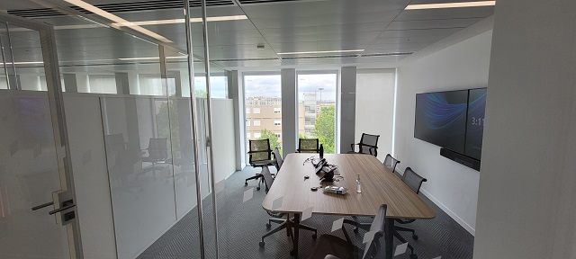
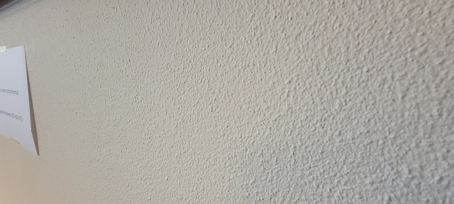

# General tips for Event Storming

## The ideal room for your in-person Event Storming {#Ideal-room}

_How to make sure you select the right room (and avoid the wrong one) for your in-person Event Storming? Use the below checklist!_

We did one of our first event storming with a team who was trying to envision a target architecture.

We had a very good relationship with the architect and the team members. So, when we offered to try Event Storming with them, they all said yes. We jumped into the wild and learned the hard way that **a room can make or break your event storming!**

The room we booked was like the one the picture. Size: 6m x 4m, with a big unmovable table in the middle, a window on one side, a screen on another wall, and a window. This only left one available wall for our event storming. Unfortunately, the wall surface was asperous. The adhesive tape was not sticking onto it. The kraft paper fell several times!

Due to a lack of space to move around, the 10 participants had to stay packed in front of the wall. The room temperature started to rise. We opened the window to get some fresh air but got the street noise instead. We had to open the door and, as a result, hide a part of the event storming. Then some participants spotted the comfortable chairs and decided to use them.

**Bottom line: this first experience was rather “amateur” and participants disengaged themselves quickly.**

**Hopefully, after reading this chapter, you should not reproduce our rookie mistakes!**

The following checklist will help you pick the right room. This list is applicable for any kind of event storming (big picture, design level or event storming the flow) as the room settings is similar in all cases.

### What you want for your room is:

-	A long wall: aim at 5m minimum – more is better (Alberto Brandolini mentions 8m!).
-	Other walls to stick posters
-	A room that is big enough so people:
    -	can step back (physically) to look at the long wall
    -	feel comfortable and not squeezed
    -	can move around without being blocked by others
    -	can find a space to gather in smaller group for a few minutes
-	A room that is not too big so people are less likely to keep physically distant from the main wall. As a rule of thumb, **if the participants are standing between you and the wall, you should still be able to read the tickets** if written with block letters.
-	A room with windows to let light and air come in. You want participants to be able to breathe and open their minds!

### What you don’t want is:

-	A room with plenty of digital screens. You won’t need them as you won’t do any presentation. Apart from this, having screens keeps the walls busy and is likely to distract people from having conversations.
-	A room with glass walls
-	An open space through which outside people can walk
-	A room that gets hot or with low ventilation. Participants will stand up most of the time. They will move around and be standing together in front of an area of work on a wall. This is not possible when you get hot or start to sweat!
-	A room that is very bright. We had a case where the room we used was filled with natural light and big windows. It proved to be problematic as it was a source of visual fatigue.
-	An island table in the middle. You should look for a room where chairs can quickly be moved around and where tables are pushed on the side for people to put their bags, cups and personal stuff.
-	A room with pillars and other physical barriers.

### In a nutshell

As mentioned, in our experience, the room is an important enabler of the success of in-person event storming workshops.

Basically, it boils down to: **“a room with at least one long wall and enough space for people to move around. Not a fancy/modern one but rather a simple space without chairs or table in the middle”**.

### What’s next?

Once you booked the right room, you can refer to other chapters in this book:
-   Use [this other checklist to  prepare the room when running an event storming](#big-picture--room)
-   Or use [event storming for workflow improvement](#Event-Storming--Flow).

## Going Further with Event Storming

